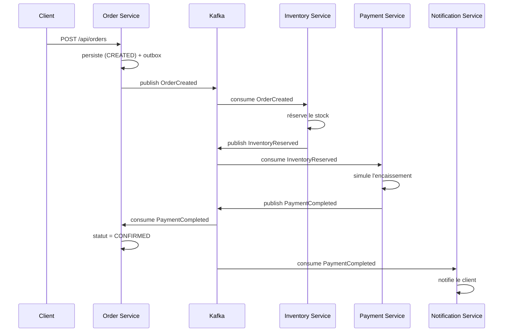
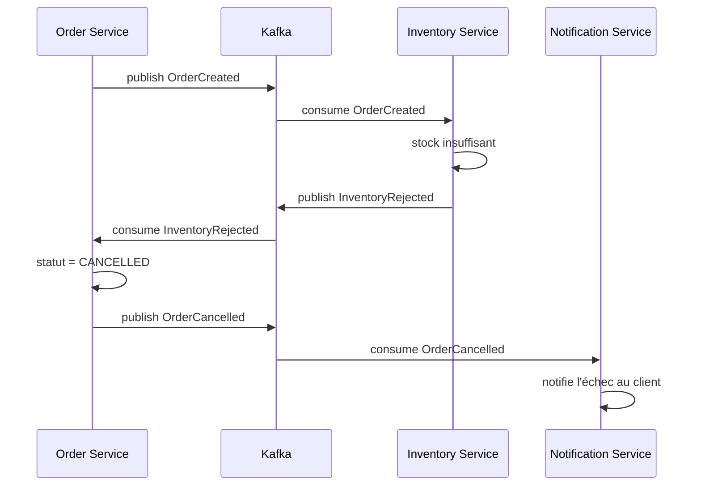
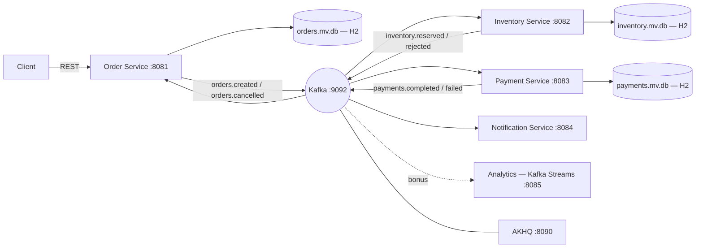

# Dossier technique et fonctionnel — OrderFlow (v2)

**Java 25 · Spring Boot 4.1.1 · Spring Kafka 4.1.1 · Apache Kafka 4.3.1 (KRaft) · H2 embarqué**
**Deux modes d'exécution : poste sans droits administrateur (natif) ou avec droits administrateur (Docker Compose)**

*Document complémentaire au cahier des charges. Il détaille la conception fonctionnelle (acteurs, cas d'usage,
événements), la conception technique (architecture, patterns, tests) et les procédures d'installation locale, sans
élévation de privilèges ou avec Docker Compose.*

---

## 1. Introduction

Ce dossier traduit les exigences du cahier des charges en une conception exploitable. Il est volontairement
**prescriptif sur le "quoi"** (topics, contrats, patterns, critères de validation, versions) et **ouvert sur le "
comment"** (l'implémentation reste l'exercice) : c'est un support d'auto-formation, pas un corrigé.

Le §12 est le plus important en pratique : il garantit que **rien dans ce projet ne nécessite de droits
administrateur**, tout en proposant un démarrage Docker Compose quand on dispose de ces droits.

---

## 2. Vue fonctionnelle

### 2.1 Acteurs

| Acteur                      | Rôle                                                |
|-----------------------------|-----------------------------------------------------|
| Client (API)                | Passe une commande, consulte son statut             |
| Order Service               | Point d'entrée, source de vérité de la commande     |
| Inventory Service           | Vérifie et réserve le stock                         |
| Payment Service             | Simule l'encaissement                               |
| Notification Service        | Notifie le client du résultat final                 |
| Shipping Service *(bonus)*  | Planifie une expédition après paiement confirmé     |
| Analytics Service *(bonus)* | Agrège les événements en temps réel (Kafka Streams) |

### 2.2 Cas d'utilisation détaillés

**UC1 — Passer une commande**

- Acteur principal : Client
- Préconditions : le client existe (simplifié, pas d'auth complète)
- Scénario nominal :
    1. `POST /api/orders` avec la liste d'articles
    2. Order Service persiste la commande en statut `CREATED` et publie `OrderCreated`
    3. Inventory Service réserve le stock → publie `InventoryReserved`
    4. Payment Service encaisse → publie `PaymentCompleted`
    5. Order Service passe la commande en `CONFIRMED`
    6. Notification Service notifie le client
- Alternative (stock insuffisant) : Inventory publie `InventoryRejected` → Order passe en `CANCELLED` → Notification
  informe le client
- Alternative (paiement refusé) : Payment publie `PaymentFailed` → Order passe en `CANCELLED` → Inventory **compense**
  en libérant le stock réservé (consommation de `OrderCancelled`)

**UC2 — Consulter le statut d'une commande**
`GET /api/orders/{id}` retourne le statut courant + l'historique des événements traités.

**UC3 — Visualiser l'activité en temps réel** *(bonus)*
Tableau de bord alimenté par une topologie Kafka Streams : commandes par statut, chiffre d'affaires cumulé.

**UC4 — Rejouer un message en erreur** *(bonus)*
Consultation de la Dead Letter Topic (via AKHQ ou une API dédiée) et renvoi d'un message corrigé vers le topic
d'origine.

### 2.3 Flux nominal



### 2.4 Flux de compensation (stock insuffisant)



---

## 3. Catalogue des événements Kafka

| Topic                | Producteur          | Consommateur(s)                                         | Clé       | Partitions (dev) | Rétention |
|----------------------|---------------------|---------------------------------------------------------|-----------|------------------|-----------|
| `orders.created`     | Order Service       | Inventory Service                                       | `orderId` | 3                | 7 j       |
| `orders.cancelled`   | Order Service       | Inventory Service, Notification Service                 | `orderId` | 3                | 7 j       |
| `inventory.reserved` | Inventory Service   | Payment Service                                         | `orderId` | 3                | 7 j       |
| `inventory.rejected` | Inventory Service   | Order Service, Notification Service                     | `orderId` | 3                | 7 j       |
| `payments.completed` | Payment Service     | Order Service, Notification Service, Shipping *(bonus)* | `orderId` | 3                | 7 j       |
| `payments.failed`    | Payment Service     | Order Service, Notification Service                     | `orderId` | 3                | 7 j       |
| `<topic>-retry-N`    | Spring Kafka (auto) | le service d'origine                                    | héritée   | 1                | 7 j       |
| `<topic>.DLT`        | Spring Kafka (auto) | monitoring / rejeu manuel                               | héritée   | 1                | 14 j      |

**Convention** : tous les événements portent les en-têtes Kafka `correlationId`, `eventType`, `contentType`.

**Attention en local** : le broker mono-nœud impose `replication.factor=1` et `min.insync.replicas=1`. Pense à créer les
topics via `NewTopic` beans (ou `kafka-topics.sh`) plutôt que de laisser la création automatique jouer, sinon tu
hériteras des valeurs par défaut du broker.

### Exemple de payload — `OrderCreated`

```json
{
  "eventId": "b3f1c2a0-1234-4a5b-9c0d-abcdef012345",
  "eventType": "OrderCreated",
  "occurredAt": "2026-09-07T10:15:30Z",
  "correlationId": "corr-8f3e...",
  "orderId": "ord-7742",
  "customerId": "cust-118",
  "items": [
    { "productId": "sku-001", "quantity": 2, "unitPrice": 19.90 }
  ],
  "totalAmount": 39.80
}
```

---

## 4. Architecture technique



**Principe directeur** : chaque service est autonome (base dédiée), ne communique jamais en synchrone avec un autre
service métier, et ne réagit qu'aux événements Kafka (sauf l'API REST d'entrée sur Order Service).

### Plan de ports (tous > 1024, aucun privilège requis)

| Port      | Composant                                                                       |
|-----------|---------------------------------------------------------------------------------|
| 9092      | Kafka broker (listener PLAINTEXT)                                               |
| 9093      | Kafka controller (KRaft, interne)                                               |
| 29092     | Kafka, listener interne au réseau Docker (`kafka:29092`, mode avec droits admin)                |
| 8081–8085 | Services Spring Boot                                                            |
| 8090      | AKHQ                                                                            |
| 8091      | Apicurio Registry *(phase 7, optionnel)*                                        |
| 9411      | Zipkin *(phase 5, optionnel)*                                                   |
| 9095      | Prometheus *(phase 5, optionnel — 9090 est déjà pris par défaut, on le décale)* |

---

## 5. Modèle de données (par service, en H2)

**Order Service** — `~/orderflow-data/orders.mv.db`

- `orders (id, customer_id, status, total_amount, created_at, updated_at)`
- `order_items (id, order_id, product_id, quantity, unit_price)`
- `outbox_event (id, aggregate_id, event_type, payload, created_at, published boolean)` — cf. §6.1

**Inventory Service** — `~/orderflow-data/inventory.mv.db`

- `stock (product_id, sku, quantity_available, quantity_reserved)`
- `processed_events (event_id primary key, processed_at)` — cf. §6.2
- `stock_reservation (id, order_id, product_id, quantity)` — réservations par commande : la compensation ne libère
  que celles de la commande annulée

**Payment Service** — `~/orderflow-data/payments.mv.db`

- `payments (id, order_id, status, amount, created_at)`
- `processed_events (event_id primary key, processed_at)`

**Notification Service** — `notification_log (...)` *(optionnel, le service peut rester stateless)*

### Configuration H2 type (mode fichier, persistant entre redémarrages)

```yaml
spring:
  datasource:
    url: jdbc:h2:file:${user.home}/orderflow-data/orders;AUTO_SERVER=TRUE;MODE=PostgreSQL
    driver-class-name: org.h2.Driver
    username: sa
    password: ""
  jpa:
    hibernate:
      ddl-auto: update      # en dev ; Flyway/Liquibase si tu veux pousser plus loin
  h2:
    console:
      enabled: true         # console web sur /h2-console
```

`MODE=PostgreSQL` fait parler à H2 un dialecte proche de Postgres : le jour où tu porteras le projet vers un vrai
Postgres, le SQL migrera presque sans retouche. `AUTO_SERVER=TRUE` permet d'ouvrir la base depuis un autre process
(client SQL) pendant que le service tourne.

En mode Docker, `docker-compose.yml` surcharge `spring.datasource.url` par variable d'environnement : chaque service
écrit dans `/data/<base>` (`jdbc:h2:file:/data/orders;AUTO_SERVER=TRUE;MODE=PostgreSQL`), sur un volume Docker dédié
(`orders-data`, `inventory-data`, `payments-data`).

---

## 6. Patterns et bonnes pratiques Kafka à implémenter

### 6.1 Transactional Outbox Pattern

Garantir que l'écriture en base et la publication Kafka sont **atomiques** (pas de perte d'événement si le service
crashe entre les deux).

- L'écriture métier et l'insertion dans `outbox_event` se font dans **la même transaction locale**
- Un publisher (`@Scheduled` de polling) lit les lignes non publiées, les envoie sur Kafka, puis marque
  `published = true`
- *(Debezium/CDC est la variante « propre » en production, mais elle exige Kafka Connect + un connecteur : garde le
  polling ici.)*

### 6.2 Idempotent Consumer

Éviter qu'un événement retraité (redélivrance après crash, rebalance) ne duplique un effet métier.

- Table `processed_events(event_id)` avec contrainte unique, vérifiée/écrite dans la même transaction que le traitement
  métier

### 6.3 Gestion des erreurs — retry non bloquant + Dead Letter Topic

- `DefaultErrorHandler` + `ExponentialBackOff`, ou l'annotation `@RetryableTopic`
- Convention de nommage : `<topic>-retry-0`, `<topic>-retry-1`, `<topic>.DLT`
- Un message qui échoue après N tentatives part en DLT sans bloquer la partition
- Distingue bien les **erreurs de désérialisation** (jamais retryables — direction DLT immédiate, via
  `ErrorHandlingDeserializer`) des **erreurs transitoires** (retryables)

### 6.4 Saga chorégraphiée

- Pas d'orchestrateur central : chaque service réagit aux événements publiés par les autres
- La compensation (libération de stock après paiement refusé) est déclenchée par un événement (`OrderCancelled`), jamais
  par un appel direct entre services

### 6.5 Producteur idempotent & exactly-once *(bonus avancé)*

- `enable.idempotence=true` côté producer (par défaut avec les clients Kafka récents)
- `transactional.id` + `isolation.level=read_committed` côté consumer pour un traitement « lire-transformer-écrire »
  atomique
- Sur un broker mono-nœud, pense à `transaction.state.log.replication.factor=1` et `transaction.state.log.min.isr=1`
  dans `server.properties`, sinon l'initialisation transactionnelle échoue

---

## 7. Java 25 dans OrderFlow

| Fonctionnalité                | Usage suggéré                                                                                                                                                                                                                                          |
|-------------------------------|--------------------------------------------------------------------------------------------------------------------------------------------------------------------------------------------------------------------------------------------------------|
| **Records**                   | Événements et DTOs immuables : `record OrderCreatedEvent(String orderId, String customerId, List<OrderItem> items, BigDecimal totalAmount, Instant occurredAt)`                                                                                        |
| **Sealed interfaces**         | Hiérarchie fermée d'événements : `sealed interface OrderEvent permits OrderCreatedEvent, OrderCancelledEvent, OrderConfirmedEvent`                                                                                                                     |
| **Pattern matching / switch** | Router un événement désérialisé vers le bon traitement sans chaîne de `instanceof`                                                                                                                                                                     |
| **Virtual threads**           | `spring.threads.virtual.enabled=true` pour les traitements I/O-bound. À activer en phase 9 et à mesurer, pas par défaut : sur un listener Kafka, le parallélisme utile est d'abord borné par le nombre de partitions et la `concurrency` du container. |
| **Text blocks**               | Payloads JSON de test, fixtures SQL                                                                                                                                                                                                                    |

---

## 8. Contrats API REST (Order Service)

| Endpoint                       | Méthode | Description                       |
|--------------------------------|---------|-----------------------------------|
| `/api/orders`                  | POST    | Crée une commande                 |
| `/api/orders/{id}`             | GET     | Statut courant                    |
| `/api/orders/{id}/history`     | GET     | Historique des événements traités |
| `/api/orders?status=CANCELLED` | GET     | Liste par statut                  |

**Requête `POST /api/orders`**

```json
{
  "customerId": "cust-118",
  "items": [ { "productId": "sku-001", "quantity": 2 } ]
}
```

**Réponse**

```json
{ "orderId": "ord-7742", "status": "CREATED", "totalAmount": 39.80 }
```

---

## 9. Format des événements et évolution de schéma

- **Phase initiale** : JSON (Jackson), en-têtes Kafka `eventType` / `correlationId` / `contentType`
- **Phase avancée (§13, phase 7)** : Avro
    - Règle de compatibilité visée : `BACKWARD`
    - Exercice attendu : ajouter un champ optionnel à `OrderCreatedEvent` sans casser les consommateurs existants

---

## 10. Stratégie de test — sans Docker

C'est le point où la contrainte « pas d'admin » change le plus la conception par rapport à un projet classique. La stratégie reste la même en mode Docker : on garde
`@EmbeddedKafka` plutôt que Testcontainers, pour que `mvn verify` passe à l'identique sur un poste bridé.

| Niveau            | Outils                                     | Portée                                                |
|-------------------|--------------------------------------------|-------------------------------------------------------|
| Unitaire          | JUnit 5 + Mockito                          | Règles de réservation, règles d'encaissement simulé   |
| Intégration Kafka | **`spring-kafka-test` : `@EmbeddedKafka`** | Flux nominal, flux de compensation, poison pill → DLT |
| Intégration base  | **H2 en mémoire** (`jdbc:h2:mem:test`)     | Persistance, outbox, idempotence                      |
| Contrat           | Vérification de compatibilité Avro         | Non-régression lors des évolutions de schéma          |
| Charge *(bonus)*  | k6 ou Gatling sur l'API REST               | Vérifier NF-06                                        |

### Points d'attention `@EmbeddedKafka` (spécifiques à Kafka 4.x / Spring Kafka 4.x)

- Kafka 4.0 ayant complètement basculé en KRaft, seule l'implémentation `EmbeddedKafkaKraftBroker` subsiste — elle
  démarre un broker et un controller **dans la JVM de test**, sans Docker ni binaire externe.
- **Piège important** : avec le broker KRaft embarqué, il n'est **pas possible de fixer les ports**. Le test doit lire
  l'adresse via la propriété `spring.embedded.kafka.brokers` et ne jamais coder en dur `localhost:9092`.

```java
@SpringBootTest
@EmbeddedKafka(
    partitions = 3,
    topics = { "orders.created", "inventory.reserved" }
)
@TestPropertySource(properties = {
    "spring.kafka.bootstrap-servers=${spring.embedded.kafka.brokers}",
    "spring.datasource.url=jdbc:h2:mem:test;DB_CLOSE_DELAY=-1"
})
@DirtiesContext
class OrderSagaIntegrationTest { /* ... */ }
```

- Ajoute `@DirtiesContext` sur les classes de test embarquant un broker, pour éviter les conditions de course à l'arrêt
  de la JVM quand plusieurs tests s'enchaînent.
- Un broker embarqué coûte quelques secondes au démarrage : regroupe les tests d'intégration dans un petit nombre de
  classes plutôt que d'en semer partout.

---

## 11. Observabilité

- **Métriques** : Micrometer + endpoint Actuator `/actuator/prometheus` — lag par consumer group, débit, latence de bout
  en bout
- **Logs structurés** : Spring Boot sait produire du JSON nativement (`logging.structured.format.console=ecs`) ; propage
  le `correlationId` depuis les en-têtes Kafka jusqu'au MDC
- **Tracing distribué** : Micrometer Tracing + OpenTelemetry. Spring Boot 4.1 applique automatiquement les beans
  `KafkaListenerObservationConvention` au container factory et `KafkaTemplateObservationConvention` au `KafkaTemplate` —
  l'instrumentation Kafka est donc quasi gratuite.
- **Collecteurs (tous sans admin)** :
    - **Zipkin** — un unique JAR exécutable (`java -jar zipkin.jar`), le plus simple pour démarrer
    - **Prometheus** — archive `.zip`/`.tar.gz`, binaire autonome,
      `prometheus.exe --config.file=prometheus.yml --web.listen-address=:9095`
    - **Grafana** — archive `.zip` « standalone », `bin\grafana-server.exe` depuis le répertoire décompressé

Si le réseau d'entreprise bloque ces téléchargements, tu peux rester sur `/actuator/prometheus` en brut et
`/actuator/metrics` : l'exercice pédagogique (instrumenter, nommer les métriques, propager la corrélation) est déjà
couvert.

---

## 12. Installation locale

Deux procédures pour le même code et les mêmes ports (9092, 8081–8084, 8090) — ne pas les faire tourner en même
temps :

- **Avec droits administrateur** : Docker Compose démarre Kafka, AKHQ et les services.
- **Sans droits administrateur** : tout est décompressé et lancé depuis le répertoire utilisateur (§12.1 à §12.8).

<details>
<summary>Démarrage avec droits administrateur (Docker)</summary>

#### Fichiers fournis

| Fichier              | Rôle                                                                                                          |
|----------------------|---------------------------------------------------------------------------------------------------------------|
| `docker-compose.yml` | Kafka 4.3.1 (KRaft), AKHQ 0.28.0, les 4 services et leurs volumes                                             |
| `Dockerfile`         | image d'un service : build Maven (`maven:3.9-eclipse-temurin-25`) puis JRE 25 (`eclipse-temurin:25-jre`), utilisateur non root |
| `.dockerignore`      | limite le contexte de build aux `pom.xml` et aux sources                                                      |

#### Réseau Kafka

Le broker expose deux listeners, pour que les conteneurs et le poste le joignent chacun à la bonne adresse :

| Listener     | Adresse annoncée | Utilisé par                                                  |
|--------------|------------------|--------------------------------------------------------------|
| `INTERNAL`   | `kafka:29092`    | services et AKHQ, dans le réseau Docker                      |
| `EXTERNAL`   | `localhost:9092` | le poste : IDE, `mvn spring-boot:run`, outils en ligne de commande |
| `CONTROLLER` | `kafka:9093`     | quorum KRaft (interne)                                       |

Réglages mono-nœud identiques au §12.4 : `num.partitions=3`, facteurs de réplication et `min.isr` à 1.

Les `application.yml` ne changent pas : `docker-compose.yml` surcharge par variables d'environnement
`spring.kafka.bootstrap-servers` (`kafka:29092`) et `spring.datasource.url` (`jdbc:h2:file:/data/<base>`), et autorise
la console H2 depuis l'hôte (`spring.h2.console.settings.web-allow-others`).

#### Démarrer

```bash
docker compose up -d --build                 # tout : Kafka, AKHQ et les 4 services
docker compose up -d kafka akhq              # infra seule, services lancés depuis l'IDE
docker compose ps                            # état et healthchecks
docker compose logs -f order-service         # logs d'un service
```

#### Arrêter, réinitialiser

```bash
docker compose down      # garde les volumes (données Kafka et H2)
docker compose down -v   # efface Kafka et les bases H2
```

#### Checklist de validation (mode Docker)

- [ ] `docker compose ps` affiche `kafka` en `healthy` et les 4 services démarrés
- [ ] AKHQ s'ouvre sur `http://localhost:8090` et voit le cluster `orderflow-docker`
- [ ] `POST /api/orders` avec `sku-001 x2` aboutit à `CONFIRMED`
- [ ] Les topics `orders.*`, `inventory.*` et `payments.*` apparaissent dans AKHQ

</details>

<details>
<summary>Démarrage sans droits administrateur</summary>

### 12.1 Arborescence cible

Tout vit dans le répertoire utilisateur. Aucun écrit hors de celui-ci.

```
%USERPROFILE%\dev\              (Windows)   /  ~/dev/   (Linux, macOS)
├── jdk-25.0.4.1+1\
├── kafka_2.13-4.3.1\
├── apache-maven-3.9.16\        (optionnel si tu utilises mvnw)
├── akhq\
│   ├── akhq-0.28.0-all.jar
│   └── application.yml
├── kafka-logs\                 (données du broker — chemin volontairement court)
└── orderflow\                  (le dépôt du projet)

%USERPROFILE%\orderflow-data\   (fichiers H2)
```

**Windows — chemin court obligatoire.** Kafka crée des noms de répertoires de partition longs (`orders.created-0`, plus
les index). Combiné à un `%USERPROFILE%` déjà profond, tu peux dépasser la limite historique de 260 caractères. Place
`kafka-logs` haut dans l'arborescence (`C:\dev\kafka-logs` si tu as le droit d'écrire à la racine, sinon
`%USERPROFILE%\dev\kafka-logs`) et garde des noms de topics courts.

### 12.2 JDK 25 (contrainte AKHQ) sans installeur

1. Télécharger **Eclipse Temurin jdk-25.0.4.1+1** au format **`.zip`** (Windows) ou **`.tar.gz`** (Linux, macOS) depuis
   adoptium.net — surtout pas le `.msi` ni le `.pkg`, qui demandent l'admin.
2. Décompresser dans `~/dev/jdk-25.0.4.1+1`.
3. Déclarer les variables **au niveau utilisateur** (aucun privilège requis) :

*Windows (PowerShell ou cmd, session normale) :*

```cmd
setx JAVA_HOME "%USERPROFILE%\dev\jdk-25.0.4.1+1"
setx PATH "%JAVA_HOME%\bin;%PATH%"
```

*Linux / macOS (`~/.bashrc` ou `~/.zshrc`) :*

```bash
export JAVA_HOME="$HOME/dev/jdk-25.0.4.1+1"
export PATH="$JAVA_HOME/bin:$PATH"
```

Vérification : `java -version` doit afficher `25.0.4.1`.

> Si même `setx` est bloqué par une GPO, tu peux définir `JAVA_HOME` et `PATH` uniquement dans un script `env.cmd` /
> `env.sh` que tu sources avant chaque session. Le projet fonctionne à l'identique.

### 12.3 Maven — préfère le wrapper

La solution la plus robuste sur poste bridé : **générer le projet depuis start.spring.io**, qui embarque `mvnw` /
`mvnw.cmd`. Le wrapper télécharge Maven tout seul dans `~/.m2/wrapper` — rien à installer, rien à mettre dans le `PATH`.

Si tu préfères Maven en ligne de commande : Maven 3.9.16 se distribue en archive `.zip` ; il suffit de décompresser et
d'ajouter `bin` au `PATH` utilisateur, ce qui fonctionne sur tout OS sans privilège.

> **Proxy d'entreprise** : si Maven n'atteint pas Maven Central, configure `~/.m2/settings.xml` avec le bloc
> `<proxies>`. C'est le blocage le plus fréquent sur poste d'ESN — anticipe-le avant la phase 1.

### 12.4 Kafka 4.3.1 en KRaft, lancé à la main

1. Télécharger **`kafka_2.13-4.3.1.tgz`** (build binaire Scala 2.13) et le décompresser dans `~/dev/kafka_2.13-4.3.1`.
2. Éditer `config/server.properties` pour pointer vers ton répertoire de logs et adapter les réplications au mono-nœud :

```properties
log.dirs=C:/dev/kafka-logs
offsets.topic.replication.factor=1
transaction.state.log.replication.factor=1
transaction.state.log.min.isr=1
num.partitions=3
```

3. **Formater le stockage une seule fois** (obligatoire en KRaft) :

*Linux / macOS :*

```bash
cd ~/dev/kafka_2.13-4.3.1
KAFKA_CLUSTER_ID="$(bin/kafka-storage.sh random-uuid)"
bin/kafka-storage.sh format --standalone -t $KAFKA_CLUSTER_ID -c config/server.properties
```

*Windows :*

```cmd
cd %USERPROFILE%\dev\kafka_2.13-4.3.1
bin\windows\kafka-storage.bat random-uuid
:: copier l'UUID retourné, puis :
bin\windows\kafka-storage.bat format --standalone -t <UUID> -c config\server.properties
```

⚠️Remarques⚠️:

* Le `wmic` windows étant déprécié. Il faut définir manuellement la taille de la mémoire pour l'environnement Java de
  Kafka avant de lancer le serveur à l'aide de la variable d'environnement `KAFKA_HEAP_OPTS`.
* Log4j (1) est déprécié et il est nécessaire de définir la localisation du fichier de configuration log4j2.yaml via la
  variable d'environnement `KAFKA_LOG4J_OPTS`

```bash
# Si erreur wmic alors ajouter cela dans vos path
setx KAFKA_HEAP_OPTS "-Xms512M -Xmx1G"
# Pour vérifier si vous êtes en présence de log4j executer cette commande
dir C:\kafka_2.13-4.3.1\config\*log4j* #windows (cmd)
# Si vous voyez log4j.properties : Vous êtes bien dans le cas visé par l'avertissement. Ce fichier utilise la syntaxe obsolète de Log4j 1.x.
# Dans ce cas suivre la procedure de conversion  https://logging.apache.org/log4j/2.x/migrate-from-log4j1.html#Log4j2ConfigurationFormat 
# Si vous voyez log4j2.properties ou tool-log4j2.yaml : Kafka utilise déjà la nouvelle configuration.
```

4. **Démarrer le broker** (à l'aide de `start-kafka.sh` / `start-kafka.cmd`) :

Assurez-vous d'avoir ces lignes mis à jour suivant votre configuration :

```bash
bin/kafka-server-start.sh config/server.properties          # Linux, macOS
bin\windows\kafka-server-start.bat config\server.properties  # Windows
```

Le broker écoute sur `localhost:9092`. Aucun service système n'est créé : tu gardes une fenêtre de terminal ouverte, et
`Ctrl+C` arrête proprement.

**Spécificités Windows à connaître :**

- Kafka sur Windows a un défaut historique sur la suppression/rotation de fichiers de log : évite de supprimer des
  topics pendant que le broker tourne. Si tu veux repartir de zéro, arrête le broker, supprime `kafka-logs`, et
  reformate.
- Ne mets pas `kafka-logs` dans un dossier synchronisé (OneDrive, Dropbox) : la synchronisation verrouille les fichiers
  et fait planter le broker.
- L'antivirus d'entreprise peut ralentir fortement les I/O sur `kafka-logs` ; si le broker rame, c'est souvent la cause.

### 12.5 AKHQ — l'UI Kafka en un seul JAR

AKHQ **0.28.0** se lance directement depuis son JAR, sans conteneur.

1. Télécharger `akhq-0.28.0-all.jar` depuis la page des releases GitHub du projet (`tchiotludo/akhq`).
2. Créer `~/dev/akhq/application.yml` :

Pour l'authentification, si besoin, ajouter un secret de longueur minimum de 32 caratères (seule la longueur compte) et
un mot de passe en SHA256
Exemple de génération de SHA256 sous power shell pour un mot de passe "admin" :

```shell
"admin" | ForEach-Object { [System.BitConverter]::ToString([System.Security.Cryptography.SHA256]::Create().ComputeHash([System.Text.Encoding]::UTF8.GetBytes($_))).Replace("-","").ToLower() }
```

```yaml
micronaut:
  server:
    port: 8090

  security:
    enabled: true
    token:
      jwt:
        signatures:
          secret:
            generator:
              secret: "QEkmFOOhy6Mgk9jlTzmGDvUrOQx1dvj7kaX"

akhq:
  security:
    default-group: no-roles

    basic-auth:
      - username: admin
        password: "HASH_SHA256_ICI"
        groups:
          - admin

  connections:
    orderflow-local:
      properties:
        bootstrap.servers: "localhost:9092"
```

3. Lancer :

```bash
java -Dmicronaut.config.files=application.yml -jar akhq-0.28.0-all.jar
```

UI accessible sur `http://localhost:8090` : topics, messages, consumer groups, lag, DLT.

### 12.6 Base de données — rien à installer

H2 arrive comme simple dépendance Maven. Aucun serveur, aucun service, aucun port à ouvrir en mode fichier. La console
web H2 (`/h2-console`) suffit pour inspecter les tables.

```xml
<dependency>
  <groupId>com.h2database</groupId>
  <artifactId>h2</artifactId>
  <scope>runtime</scope>
</dependency>
```

### 12.7 `pom.xml` de référence (extrait)

```xml
<parent>
  <groupId>org.springframework.boot</groupId>
  <artifactId>spring-boot-starter-parent</artifactId>
  <version>4.1.1</version>
</parent>

<properties>
  <java.version>25</java.version>
</properties>

<dependencies>
  <dependency>
    <groupId>org.springframework.boot</groupId>
    <artifactId>spring-boot-starter-web</artifactId>
  </dependency>
  <!-- OBLIGATOIRE en Spring Boot 4 : le starter Kafka doit être déclaré explicitement -->
  <dependency>
    <groupId>org.springframework.boot</groupId>
    <artifactId>spring-boot-starter-kafka</artifactId>
  </dependency>
  <dependency>
    <groupId>org.springframework.boot</groupId>
    <artifactId>spring-boot-starter-data-jpa</artifactId>
  </dependency>
  <dependency>
    <groupId>org.springframework.boot</groupId>
    <artifactId>spring-boot-starter-actuator</artifactId>
  </dependency>
  <dependency>
    <groupId>com.h2database</groupId>
    <artifactId>h2</artifactId>
    <scope>runtime</scope>
  </dependency>

  <dependency>
    <groupId>org.springframework.boot</groupId>
    <artifactId>spring-boot-starter-test</artifactId>
    <scope>test</scope>
  </dependency>
  <dependency>
    <groupId>org.springframework.kafka</groupId>
    <artifactId>spring-kafka-test</artifactId>
    <scope>test</scope>
  </dependency>
</dependencies>
```

### 12.8 Checklist de validation du poste (à faire en phase 0)

- [x] `java -version` retourne 25.0.4.1, sans avoir lancé d'installeur
- [x] `mvnw -v` fonctionne (le wrapper a téléchargé Maven tout seul)
- [x] `mvnw dependency:resolve` passe (proxy correctement configuré si nécessaire)
- [x] Le broker Kafka démarre et `bin/kafka-topics.sh --list --bootstrap-server localhost:9092` répond
- [x] AKHQ s'ouvre sur `http://localhost:8090` et voit le cluster
- [x] Un test `@EmbeddedKafka` minimal passe en vert
- [x] Aucune fenêtre UAC / `sudo` n'a été nécessaire à aucune étape

</details>

---

## 13. Feuille de route technique détaillée

### Phase 0 — Socle local

- **Objectif** : JDK 25, Kafka 4.3.1 KRaft, AKHQ opérationnels — en natif sans admin (§12.1 à §12.8) ou via Docker
  Compose avec admin (§12) ; un producer/consumer « hello world »
- **Compétences** : configuration Spring Kafka 4.x, sérialisation JSON, formatage KRaft
- **Validation** : la checklist du mode choisi (§12.8, ou celle du mode Docker au §12) est intégralement cochée, et un message publié apparaît dans AKHQ

### Phase 1 — Premier flux Order → Inventory

- **Objectif** : `POST /api/orders` fonctionnel, publication `OrderCreated`, consommation et réservation de stock
- **Livrables** : Order Service + Inventory Service, tables `orders`, `stock`
- **Validation** : une commande créée déclenche une réservation de stock visible dans la console H2

### Phase 2 — Payment + saga chorégraphiée

- **Objectif** : Payment Service simule l'encaissement, le statut de la commande évolue selon le résultat
- **Validation** : les deux scénarios (paiement OK / KO) aboutissent au bon statut final

### Phase 3 — Idempotence + Outbox transactionnel

- **Objectif** : plus d'effet dupliqué en cas de retraitement ; plus de perte d'événement si le service crashe entre
  l'écriture DB et la publication Kafka
- **Validation** : un test qui republie deux fois le même événement ne réserve le stock qu'une fois

### Phase 4 — Résilience : retry topics + DLT

- **Objectif** : un message invalide part en DLT après N tentatives sans bloquer les autres messages
- **Validation** : test d'intégration envoyant un payload corrompu, vérifiant sa présence dans la DLT (et visible dans
  AKHQ)

### Phase 5 — Observabilité

- **Objectif** : métriques Prometheus, logs corrélés, tracing distribué
- **Validation** : une commande est traçable de bout en bout via son `correlationId` dans les logs des trois services

### Phase 6 — Notification + API de consultation

- **Objectif** : Notification Service, endpoints `GET /api/orders/{id}` et `/history`
- **Validation** : l'historique complet d'une commande est restituable via l'API

### Phase 7 — Migration Avro (et registre de schémas)

- **Objectif** : au moins un topic migré en Avro, avec ajout d'un champ optionnel testé en compatibilité `BACKWARD`
- **Plan A** : registre de schémas local — **Apicurio Registry 3.3.0** se lance en JAR Quarkus
  (`java -jar apicurio-registry-app-3.3.0-runner.jar -Dquarkus.http.port=8091`) avec stockage en mémoire, donc sans
  admin ni base externe. Vérifie que l'asset JAR est bien publié sur la release GitHub que tu télécharges ; sinon la
  distribution Confluent Community (archive `.tgz`, script `bin/schema-registry-start`) fait le même travail, également
  sans installation.
- **Plan B (si les téléchargements sont bloqués)** : faire l'exercice Avro **sans registre**. Génère les classes avec
  `avro-maven-plugin` depuis des `.avsc` versionnés dans le dépôt, sérialise en Avro binaire, et valide manuellement la
  compatibilité de schéma via l'API `SchemaCompatibility` d'Avro dans un test. Tu perds la partie « registre
  centralisé » mais tu conserves l'essentiel : schémas explicites, génération de code, règles de compatibilité.
- **Validation** : un consommateur écrit contre l'ancien schéma lit toujours les messages produits avec le nouveau

### Phase 8 — *(Bonus)* Kafka Streams

- **Objectif** : Analytics Service agrège en temps réel commandes/statut et chiffre d'affaires
- **Note sans admin** : Kafka Streams utilise RocksDB, qui embarque une bibliothèque native extraite au runtime dans le
  répertoire temporaire. Si l'antivirus ou une politique d'exécution bloque `%TEMP%`, redirige le state dir avec
  `state.dir=${user.home}/orderflow-data/streams` et, au besoin, `-Djava.io.tmpdir=%USERPROFILE%\dev\tmp`.
- **Validation** : le compteur reflète l'état réel après rejeu du topic depuis le début

### Phase 9 — *(Bonus)* Exactly-once, chaos testing, virtual threads

- **Objectif** : producteur transactionnel, arrêt brutal du broker/consumer, passage des listeners aux virtual threads
  avec mesure avant/après
- **Validation** : aucune perte ni duplication après un arrêt brutal simulé

---

## 14. Annexes

### Glossaire

- **Topic** : flux nommé de messages, découpé en partitions
- **Partition** : unité de parallélisme et d'ordonnancement au sein d'un topic
- **Offset** : position d'un message dans une partition
- **Consumer Group** : ensemble de consumers se répartissant les partitions d'un topic
- **Replication Factor** : nombre de copies d'une partition (forcément 1 en local mono-nœud)
- **ISR (In-Sync Replicas)** : répliques à jour d'une partition
- **KRaft** : mode de consensus interne de Kafka, sans Zookeeper — seul mode disponible depuis Kafka 4.0
- **Exactly-once semantics** : garantie qu'un message est traité exactement une fois malgré les pannes
- **DLT (Dead Letter Topic)** : topic recevant les messages non traitables après épuisement des tentatives

### Récapitulatif des versions (7 septembre 2026)

| Composant                       | Version                   |
|---------------------------------|---------------------------|
| Eclipse Temurin JDK             | 25.0.4.1+1 (LTS)         |
| Apache Kafka                    | 4.3.1 (Scala 2.13)        |
| Spring Boot                     | 4.1.1                     |
| Spring Framework                | 7.0.9                     |
| Spring for Apache Kafka         | 4.1.1                     |
| Apache Maven                    | 3.9.16 (ou Maven Wrapper) |
| H2 Database                     | 2.4.240                   |
| AKHQ                            | 0.28.0                    |
| Apicurio Registry *(optionnel)* | 3.3.0                     |
| Image Kafka *(mode Docker)*     | `apache/kafka:4.3.1`      |
| Image AKHQ *(mode Docker)*      | `tchiotludo/akhq:0.28.0`  |
| Images build / exécution *(mode Docker)* | `maven:3.9-eclipse-temurin-25` / `eclipse-temurin:25-jre` |

Ces versions bougent vite (Kafka vise trois releases par an, Spring Boot deux). Revérifie-les au démarrage du projet ;
les procédures du §12 restent valables quelle que soit la version mineure.

### Ressources

- Documentation officielle **Spring for Apache Kafka** (chapitre *Testing Applications* pour `@EmbeddedKafka`)
- Documentation officielle **Apache Kafka 4.3** (quickstart KRaft)
- Notes de version **Spring Boot 4.1**
