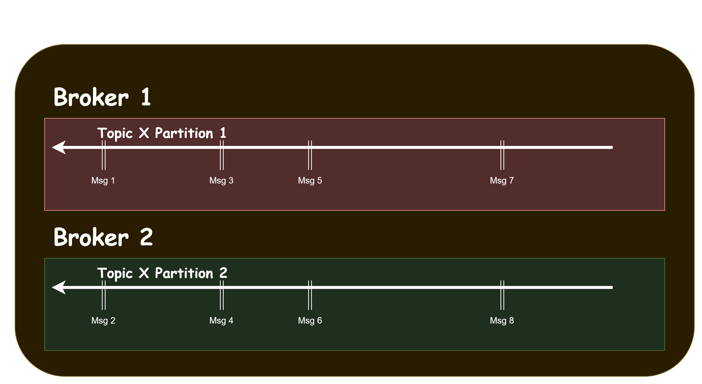
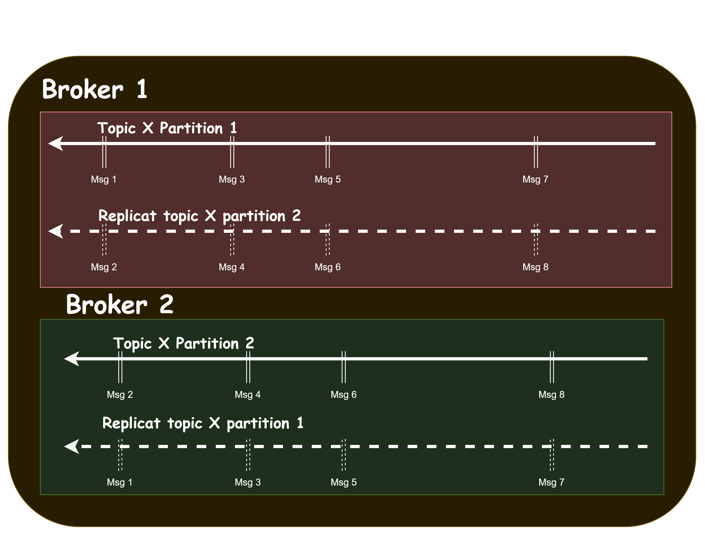

# Kafka

## Définitions & concepts

* **Event**: 
    * Description d'une action (ex métier: passage d'une commande, d'un payement, via un site e-commerce)
    * A diffuser à un ou plusieurs microservices
    * Stockés sous forme de messages
    * Stockés dans une couche logique nommée topics
* **Event Streaming** : Diffusion d'événements en continu
* **Producer** (écriture)
    * Application cliente qui écrit des données
    * Dans un ou des topics
* **Consumer** (lecture)
    * Application client qui souscrit à des topics
* **Asynchrone** 
    * Découplage entre l'activité du/des producers
    * Découplage entre l'activité et du/des consumers
* **Topics**
    * Une couche logique de stockage des messages
    * Permattant de lire et de relire les messages
    * Les messages ne sont pas détruits
* **Commit log**
    * Méthode empoyé par Kafka pour stocker les messages
    * Ordonnée, séquentiel et jamais détruit lors de leur consommation
* **Offset**
    * Caractéristiques : où commencer (plus tôt ou plus tard)
    * Important pour attester de la bonne délivrance du message
* **Partition**
    * Fragmentation logique des topics en morceau
    * Permet de distribuer sur l'ensemble d'un même cluster
    * En les conservant dans le même topic
    * Important pour la performance et la scalabilité

_Exemple de cluster partitionné_

* **Clef de partition**
    * Information utilisée pour déterminer où stocker
    * Défini dans quelle partition
    * Fonction de hachage
* **Segment** (partition découpé)
    * au sein des partitions
    * regroupement de messages pour un stockage physique
    * veleur par défaut = 1GB
* **Réplication**
    * Les partitions sont dupliquées (haute disponibilité)
    * Sur un ou plusieurs autre serveurs (brokers)
    * Leader vs Follower (Broker principal ou secondaire)

Exemple de cluster partitionné avec Replicat

* **Consumer Group**, à la différence des producers dont le travail est plus simple :
    * Les consumers doivent s'organiser pour consommer les partitions
    * Potentiellement de différents topics
    * Un des brokers à en charge de coordonner (coordinator)
        * coordinator est en charge de l'offset
