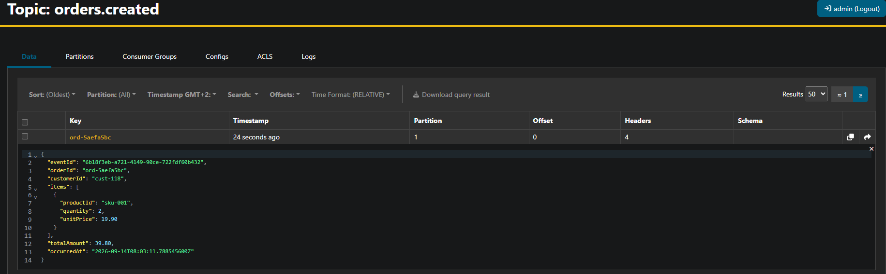
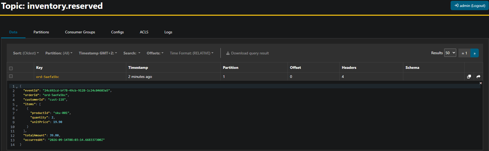

# Kafka

<details>
<summary>Définitions & concepts</summary>

* `Event`:
    * Description d'une action (ex métier: passage d'une commande, d'un payment, via un site e-commerce)
    * A diffuser à un ou plusieurs microservices
    * Stockés sous forme de messages
    * Stockés dans une couche logique nommée topics
* `Event Streaming` : Diffusion d'événements en continu
* `Producer` (écriture)
    * Application cliente qui écrit des données
    * Dans un ou des topics
* `Consumer` (lecture)
    * Application client qui souscrit à des topics
* `Asynchrone`
    * Découplage entre l'activité du/des producers
    * Découplage entre l'activité et du/des consumers
* `Topics`
    * Une couche logique de stockage des messages
    * Permettant de lire et de relire les messages
    * Les messages ne sont pas détruits
* `Commit log`
    * Méthode employée par Kafka pour stocker les messages
    * Ordonnée, séquentiel et jamais détruit lors de leur consommation
* `Offset`
    * Caractéristiques : où commencer (plus tôt ou plus tard)
    * Important pour attester de la bonne délivrance du message
* `Partition`
    * Fragmentation logique des topics en morceau
    * Permet de distribuer sur l'ensemble d'un même cluster
    * En les conservant dans le même topic
    * Important pour la performance et la scalabilité

_Exemple de cluster partitionné_


* `Clef de partition`
    * Information utilisée pour déterminer où stocker
    * Défini dans quelle partition
    * Fonction de hachage
* `Segment` (partition découpé)
    * au sein des partitions
    * regroupement de messages pour un stockage physique
    * valeur par défaut = 1GB
* `Réplication`
    * Les partitions sont dupliquées (haute disponibilité)
    * Sur un ou plusieurs autre serveurs (brokers)
    * Leader vs Follower (Broker principal ou secondaire)

Exemple de cluster partitionné avec Replicat


* `Consumer Group`, à la différence des producers dont le travail est plus simple :
    * Les consumers doivent s'organiser pour consommer les partitions
    * Potentiellement de différents topics
    * Un des brokers à en charge de coordonner (coordinator)
        * coordinator est en charge de l'offset

</details>

## Démarrage

Le même code tourne dans deux modes : choisis celui qui correspond à ton poste.
**Java 25** est la version de référence dans les deux cas (AKHQ 0.28.0 l'exige).

|                      | Avec droits administrateur                                              | Sans droits administrateur                            |
|----------------------|-------------------------------------------------------------------------|-------------------------------------------------------|
| Kafka 4.3.1 (KRaft)  | conteneur `apache/kafka:4.3.1`                                          | archive `kafka_2.13-4.3.1.tgz` lancée à la main       |
| AKHQ 0.28.0          | conteneur `tchiotludo/akhq:0.28.0`                                      | `akhq-0.28.0-all.jar` (Java 25)                       |
| Services Spring Boot | conteneurs construits par la [`Dockerfile`](Dockerfile), ou IDE / `mvn` | IDE ou `mvn spring-boot:run`                          |
| Bases H2             | un volume Docker par service                                            | un fichier par service dans le répertoire utilisateur |
| Tests                | `mvn clean verify` (`@EmbeddedKafka`, sans Docker)                      | `mvn clean verify` (identique)                        |

Les ports sont les mêmes dans les deux modes (Kafka `9092`, services `8081` à `8084`, AKHQ `8090`) :
ne fais pas tourner les deux en même temps.

<details>
<summary>Démarrage avec droits administrateur (Docker)</summary>

### Prérequis

- Docker Desktop (Windows, macOS) ou Docker Engine avec le plugin Compose (Linux).
- Pour lancer les services depuis l'IDE ou lancer les tests : un JDK 25 et Maven, comme dans le mode sans droits
  administrateur. Pour tout faire tourner en conteneurs, Docker suffit.

### Tout démarrer en conteneurs

```bash
docker compose up -d --build
```

Le premier lancement construit les images des 4 services : la compilation Maven se fait dans un conteneur
`maven:3.9-eclipse-temurin-25`, puis chaque service tourne sur une image `eclipse-temurin:25-jre`. Les services
attendent que Kafka soit prêt (healthcheck) avant de démarrer.

| Adresse                            | Composant                         |
|------------------------------------|-----------------------------------|
| `http://localhost:8081/api/orders` | order-service                     |
| `http://localhost:8082/api/stock`  | inventory-service                 |
| `http://localhost:8083`            | payment-service                   |
| `http://localhost:8084`            | notification-service              |
| `http://localhost:8090`            | AKHQ (cluster `orderflow-docker`) |
| `localhost:9092`                   | Kafka, depuis le poste (IDE, CLI) |

```bash
docker compose ps                            # état des conteneurs, Kafka doit être "healthy"
docker compose logs -f order-service         # logs d'un service
docker compose up -d --build order-service   # reconstruire un service après une modification du code
```

### Infra seule, services lancés depuis l'IDE

```bash
docker compose up -d kafka akhq
```

Lance ensuite les services depuis l'IDE (configurations Spring Boot d'IntelliJ ou `launch.json` de VS Code) ou avec
`mvn -pl <service> spring-boot:run`. Ils trouvent Kafka sur `localhost:9092` et leur base H2 dans le répertoire
utilisateur : `application.yml` ne change pas.

### Bases H2

Console `http://localhost:8081/h2-console` (8082 pour inventory, 8083 pour payments), utilisateur `sa`, sans mot de
passe, JDBC URL `jdbc:h2:file:/data/orders;AUTO_SERVER=TRUE;MODE=PostgreSQL` (remplacer `orders` par `inventory` ou
`payments`).

### Arrêter, repartir de zéro

```bash
docker compose down      # arrête les conteneurs, garde les données (volumes)
docker compose down -v   # arrête et efface les données Kafka et les bases H2
```

Phase 3 du TODO (outbox face à une panne du broker) : `docker compose stop kafka`, poste des commandes, puis
`docker compose start kafka`.

### Compiler et tester sans JDK sur le poste

```bash
docker run --rm -v "${PWD}:/workspace" -v orderflow-m2:/root/.m2 -w /workspace maven:3.9-eclipse-temurin-25 mvn -B clean verify
```

PowerShell ou bash, depuis la racine du dépôt. Le volume `orderflow-m2` garde le cache Maven entre deux exécutions.

### Ce que fait la configuration Docker

- [`docker-compose.yml`](docker-compose.yml) : Kafka en KRaft mono-nœud (3 partitions par défaut, réplication 1),
  AKHQ, les 4 services et leurs volumes.
- [`Dockerfile`](Dockerfile) : une seule image paramétrée par `SERVICE`, build Maven puis JRE 25, utilisateur non root.
- Le broker expose deux listeners : `kafka:29092` pour les conteneurs, `localhost:9092` pour le poste.
- Les `application.yml` ne changent pas : `docker-compose.yml` surcharge `spring.kafka.bootstrap-servers` et
  `spring.datasource.url` par variables d'environnement.
- Sous VS Code : tâches « Docker : tout demarrer », « Docker : Kafka + AKHQ seuls », « Docker : logs » et
  « Docker : arreter ».

</details>

<details>
<summary>Démarrage sans droits administrateur</summary>

Tout tourne depuis le répertoire utilisateur : archives décompressées, aucun installeur, aucun service Windows.
Procédure détaillée : [dossier technique, §12](Docs/TD/02-dossier-technique-fonctionnel-orderflow.md#12-installation-locale).

### Prérequis : un JDK 25

Archive `.zip` (Windows) ou `.tar.gz` (Linux, macOS) d'Eclipse Temurin 25, décompressée dans ton répertoire
utilisateur. Pas d'installeur. Java 25 est requis par AKHQ 0.28.0.

```bash
java -version   # doit afficher 25.x
```

### Prérequis : Maven

Le projet est livré **sans Maven Wrapper**. Deux options, toutes deux sans droits admin :

1. **Maven portable** — décompresser `apache-maven-3.9.16-bin.zip` et ajouter
   son `bin` au `PATH` utilisateur.
2. **Générer le wrapper** une fois Maven disponible, puis n'utiliser que lui :
   ```bash
   mvn -N wrapper:wrapper -Dmaven=3.9.16
   ```
   Tu obtiens `mvnw` / `mvnw.cmd`, et Maven n'a plus besoin d'être installé.

> Si ton réseau d'entreprise filtre Maven Central, configure le proxy dans
> `~/.m2/settings.xml` avant la première build. C'est le blocage le plus
> fréquent sur poste bridé.

> ZooKeeper n'est plus nécessaire : Kafka 4.x fonctionne uniquement en mode KRaft.

### Installer Kafka 4.3.1 (KRaft)

* Télécharger Kafka [quickstart](https://kafka.apache.org/43/getting-started/quickstart/)
* Décompresser le sous C:/ (Attention ne fonctionne pas si le chemin est trop long)
* Exécuter les commande dans un terminal Windows command prompt

```sh
for /f "tokens=*" %i in ('bin\windows\kafka-storage.bat random-uuid 2^>nul') do set KAFKA_CLUSTER_ID=%i
set KAFKA_CLUSTER_ID=random-uuid retourné précedemment
# Vérification
echo %KAFKA_CLUSTER_ID%
# Retourne random-uuid retourné précedemment
bin\windows\kafka-storage.bat format --standalone -t %KAFKA_CLUSTER_ID% -c config\server.properties
# doit retourner Formatting dynamic metadata voter directory /tmp/kraft-combined-logs with metadata.version 4.3-IV0.
```

* Configuration cluster et noeuf Kafka. Ouvrir pour modifier/ contrôler la configuration kafka dans le fichier
  `config/server.properties` ou (et) `controller.properties` ou (et) `broker.properties`
  (Exemple : [server.properties](Docs/server.properties)) :

| Paramètre                                                 | Définition                                                                                                                                                                                                                                                                                                                                      | Type    | Défaut                                           |
|-----------------------------------------------------------|-------------------------------------------------------------------------------------------------------------------------------------------------------------------------------------------------------------------------------------------------------------------------------------------------------------------------------------------------|---------|--------------------------------------------------|
| `log.dirs`                                                | Liste de répertoires (séparés par des virgules) où sont stockées les données de log. Si absent, la valeur de `log.dir` est utilisée.                                                                                                                                                                                                            | list    | `null` (repli sur `log.dir` = `/tmp/kafka-logs`) |
| `num.partitions`                                          | Nombre par défaut de partitions par topic. S'applique à la création automatique de topics, à la création de topics internes de Kafka Streams, et à `AdminClient#createTopics` quand le nombre de partitions vaut -1.                                                                                                                            | int     | `1`                                              |
| `default.replication.factor`                              | Facteur de réplication par défaut par topic, utilisé dans les mêmes cas que `num.partitions` (création auto, topics internes Streams, `AdminClient#createTopics`).                                                                                                                                                                              | int     | `1`                                              |
| `min.insync.replicas`                                     | Nombre minimal de réplicas synchronisés (ISR), leader inclus, requis pour qu'une écriture réussisse quand un producer utilise `acks=all`. Si l'ISR contient moins de membres que cette valeur, le producer reçoit une exception.                                                                                                                | int     | `1`                                              |
| `log.retention.hours`                                     | Nombre d'heures de conservation d'un fichier de log avant suppression ; paramètre tertiaire par rapport à `log.retention.ms`.                                                                                                                                                                                                                   | int     | `168`                                            |
| `log.segment.bytes`                                       | Taille maximale d'un seul fichier de segment de log.                                                                                                                                                                                                                                                                                            | int     | `1073741824` (1 GiB)                             |
| `log.retention.check.interval.ms`                         | Fréquence (en ms) à laquelle le nettoyeur de logs vérifie si des logs sont éligibles à la suppression.                                                                                                                                                                                                                                          | long    | `300000` (5 min)                                 |
| `zookeeper.connect` *(supprimé depuis 4.0)*               | Chaîne de connexion au cluster ZooKeeper, au format `host:port`, avec possibilité de lister plusieurs hôtes (`host1:port1,host2:port2,...`) et d'ajouter un chemin *chroot* (`/chemin`) pour isoler les données du cluster dans le namespace ZooKeeper.                                                                                         | list    | —                                                |
| `zookeeper.connection.timeout.ms` *(supprimé depuis 4.0)* | Délai maximal (en ms) pour que le client établisse une connexion à ZooKeeper. Si non défini, reprend la valeur de `zookeeper.session.timeout.ms` (18000 ms).                                                                                                                                                                                    | int     | —                                                |
| `auto.create.topics.enable`                               | Active la création automatique de topics côté serveur.                                                                                                                                                                                                                                                                                          | boolean | `true`                                           |
| `broker.id`                                               | Identifiant du broker pour ce serveur.                                                                                                                                                                                                                                                                                                          | int     | `-1`                                             |
| `advertised.listeners`                                    | Adresses des listeners que les brokers annoncent aux clients et aux autres brokers — utile quand `listeners` ne représente pas les adresses réellement joignables par les clients (ex. environnements cloud/NAT). Si absent, la valeur de `listeners` est utilisée. Contrairement à `listeners`, ne peut pas annoncer l'adresse méta `0.0.0.0`. | list    | `null`                                           |
| `delete.topic.enable`                                     | Quand `true`, les topics peuvent être supprimés via l'admin client ; quand `false`, les requêtes de suppression sont explicitement rejetées par le broker.                                                                                                                                                                                      | boolean | `true`                                           |

### Démarrer Kafka et AKHQ

```bash
scripts\start-kafka.cmd   # Windows : broker Kafka (KAFKA_HOME, défaut C:\kafka_2.13-4.3.1)
scripts/start-kafka.sh    # Linux, macOS : broker Kafka (KAFKA_HOME, défaut ~/dev/kafka_2.13-4.3.1)
scripts/start-akhq.sh     # AKHQ sur http://localhost:8090 (AKHQ_HOME, défaut ~/dev/akhq)
```

La configuration d'AKHQ à copier à côté du JAR est [`scripts/akhq-application.yml`](scripts/akhq-application.yml).
Sous VS Code : tâche « Kafka : demarrer le broker ».

### Compiler et tester

```bash
mvn clean verify
```

Aucun service externe n'est nécessaire : les tests d'intégration démarrent un broker Kafka dans la JVM
(`@EmbeddedKafka`) et utilisent H2.

### Lancer les services

Kafka démarré, quatre terminaux (ou lance seulement ce dont tu as besoin) :

```bash
mvn install -DskipTests                        # une fois : installe orderflow-common dans ~/.m2
mvn -pl order-service        spring-boot:run   # :8081
mvn -pl inventory-service    spring-boot:run   # :8082
mvn -pl payment-service      spring-boot:run   # :8083
mvn -pl notification-service spring-boot:run   # :8084
```

Ou depuis l'IDE : configurations Spring Boot d'IntelliJ, ou `launch.json` de VS Code
(« OrderFlow : tous les services »).

</details>

## TD

<details>
<summary>Travaux Dirigés</summary>

# OrderFlow — squelette sans Kafka

Cas d'école événementiel. **Toute la logique métier est écrite et testée ; la
couche Kafka est à toi.** Voir [`TODO-KAFKA.md`](TODO-KAFKA.md).

- **Java 25** · **Spring Boot 4.1.1** · **H2 embarqué** · **Maven**
- Deux modes de démarrage pour le même code : sans droits administrateur (tout depuis le répertoire utilisateur) ou
  avec droits administrateur (Docker Compose) — voir [Démarrage](#démarrage)

---

## Démarrer

Les deux procédures, avec ou sans droits administrateur, sont décrites dans la rubrique
[Démarrage](#démarrage) en tête de ce README.

### Essayer

```bash
curl -X POST http://localhost:8081/api/orders -H "Content-Type: application/json" -d "{"customerId":"cust-118","items":[{"productId":"sku-001","quantity":2}]}"
```

Dans la console d'`order-service`, tu verras la ligne d'outbox partir :

```
[NO-BROKER] topic=orders.created key=ord-3f2a1b8c headers={eventId=..., eventType=OrderCreated, ...} payload={...}
```

C'est exactement le message que Kafka transportera : topic, clé de partition,
en-têtes, payload. Il ne va nulle part aujourd'hui — c'est ce que tu vas
brancher, en écrivant un `EventPublisher` et en basculant la propriété
`orderflow.messaging.publisher` sur `kafka`.

Voir aussi les requêtes prêtes à l'emploi dans [`http/`](http/).

---

## Architecture

```
orderflow-common/          Contrats partagés : événements, topics, port EventPublisher
order-service/       :8081 Source de vérité de la commande + outbox transactionnel
inventory-service/   :8082 Réservation, rejet, compensation du stock
payment-service/     :8083 Encaissement simulé (déterministe)
notification-service/:8084 Notification client (sans état)
```

Chaque service a **sa propre base H2** : un fichier dans le répertoire utilisateur (sans droits admin) ou un
volume Docker dédié (avec droits admin). Aucune base
partagée : c'est la règle qui rend l'architecture événementielle nécessaire
plutôt que décorative.

### Les deux scénarios à connaître

| Commande                  | Résultat    | Ce que ça exerce                                    |
|---------------------------|-------------|-----------------------------------------------------|
| `sku-001` × 2 → 39,80 €   | `CONFIRMED` | Parcours nominal complet                            |
| `sku-005` × 1 → 1250,00 € | `CANCELLED` | Refus de paiement + **compensation du stock**       |
| `sku-005` × 5             | `CANCELLED` | Rejet stock (il n'y en a que 2) — sans compensation |

Le simulateur de paiement refuse au-delà de 1000 € — règle déterministe,
configurable via `orderflow.payment.refusal-threshold`.

---

## Consulter les données

Console H2 sur chaque service : `http://localhost:8081/h2-console` (8082 inventory, 8083 payments), utilisateur
`sa`, pas de mot de passe. JDBC URL :

- sans droits admin : la valeur de `spring.datasource.url` du service, par exemple
  `jdbc:h2:file:~/Users/jeanyves.ruffin/orderflow-data/orders;AUTO_SERVER=TRUE;MODE=PostgreSQL` ;
- avec droits admin (Docker) : `jdbc:h2:file:/data/orders;AUTO_SERVER=TRUE;MODE=PostgreSQL`.

Tables intéressantes :

- `orders`, `order_items`, **`outbox_event`** (côté order)
- `stock`, **`processed_events`** (côté inventory)
- `payments`, `processed_events` (côté payment)

Le contenu de `outbox_event` et `processed_events` est le meilleur support pour
comprendre les patterns avant même d'avoir branché Kafka.

---

## Points de vigilance Spring Boot 4

Le projet cible Boot 4.1.1, qui introduit deux ruptures par rapport à Boot 3 :

**Starters modulaires.** `spring-boot-starter-web` est devenu
`spring-boot-starter-webmvc`, `spring-boot-starter-json` est devenu
`spring-boot-starter-jackson`, et `spring-boot-starter-test` a été éclaté en
starters par technologie. Les anciens noms existent encore mais sont dépréciés.
Le `pom.xml` parent documente un filet de sécurité (`spring-boot-starter-classic`)
si un starter modulaire posait problème.

**Jackson 3.** Le bean auto-configuré n'est plus
`com.fasterxml.jackson.databind.ObjectMapper` mais
`tools.jackson.databind.json.JsonMapper`, immuable et thread-safe. Les exceptions
sont non checkées, et les types `java.time` sont sérialisés en ISO-8601
nativement, sans module à enregistrer. Les annotations, elles, restent dans
`com.fasterxml.jackson.annotation`.

**Côté tests**, si tu ajoutes des tranches (`@WebMvcTest`, `@DataJpaTest`), sache
que `@MockBean` a disparu au profit de `@MockitoBean`, que `@SpringBootTest` ne
configure plus MockMvc automatiquement, et que `@WebMvcTest` demande désormais le
starter `spring-boot-starter-webmvc-test`. Les tests livrés évitent
volontairement ces API : ce sont des tests unitaires purs, JUnit 5 + Mockito.

---

## Honnêteté sur ce livrable

Je n'ai **pas pu compiler ce projet** : mon environnement n'a pas accès à Maven
Central. Le code est écrit avec soin et les versions sont vérifiées, mais la
zone la plus susceptible de demander un ajustement est le nom exact de certains
starters Boot 4 dans les `pom.xml`. Si un starter ne résout pas, le bloc
`spring-boot-starter-classic` documenté dans le pom parent te débloque en une
minute.

La logique métier, elle, est du Java standard et ne dépend d'aucune de ces
subtilités.

</details>

<details>
<summary>Travaux Dirigés - Réalisation</summary>

# [Phase 1 — Premier flux Order → Inventory](TODO-KAFKA.md#phase-1)

* Ajouter les dépendances nécessaires pour implementer Kafka Spring `spring-kafka` dans `pom.xml` ainsi que l'ajout les
  paramètres dans `application.yml`

```xml

<dependency>
    <groupId>org.springframework.boot</groupId>
    <artifactId>spring-boot-starter-kafka</artifactId>
</dependency>
<dependency>
<groupId>org.springframework.kafka</groupId>
<artifactId>spring-kafka-test</artifactId>
<scope>test</scope>
</dependency>
```

```yml 
spring:
  kafka:
    bootstrap-servers: localhost:9092
    producer:
      key-serializer: org.apache.kafka.common.serialization.StringSerializer
      value-serializer: org.apache.kafka.common.serialization.StringSerializer
      acks: all
      properties:
        enable.idempotence: true
    consumer:
      group-id: order-service
      auto-offset-reset: earliest
      enable-auto-commit: false
      key-deserializer: org.apache.kafka.common.serialization.StringDeserializer
      value-deserializer: org.apache.kafka.common.serialization.StringDeserializer
    listener:
      ack-mode: record
    admin:
      fail-fast: true
orderflow:
  messaging:
    publisher: kafka
  outbox:
    poll-interval-ms: 1000
```

* Ajout des `Publisher`
  Kafka [KafkaEventPublisher.java](order-service/src/main/java/fr/orderflow/order/messaging/KafkaEventPublisher.java) en
  lieu et place du
  LoggingEventPublisher [LoggingEventPublisher.java](orderflow-common/src/main/java/fr/orderflow/common/messaging/LoggingEventPublisher.java)
  doit :
    * être un `@Component` pour que Spring le détecte comme un bean et le construit au runtime.
    * implémente `EventPublisher`, qui est déja prévu pour surcharger une méthode retournant topic key headers
      payload, qui seront nécessaires au `Publisher` Kafka.
    * définir la variable de
      type [ProducerRecord](https://kafka.apache.org/43/javadoc/org/apache/kafka/clients/producer/ProducerRecord.html)
      qui permet de créer des enregistrements.
    * ajouter à la variable de type `ProducerRecord` la liste contenu du header, au besoin.
    * envoi le `message` dans un `topic`.
    * La valeur du paramètre `orderflow.messaging.publisher` doit être `kafka` (vs logging initialement).
    * Exemple de `Publisher` :

```java

@Component
@ConditionalOnProperty(name = "orderflow.messaging.publisher", havingValue = "kafka")
public class KafkaEventPublisher implements EventPublisher {

    private final KafkaTemplate<String, String> kafkaTemplate;

    public KafkaEventPublisher(KafkaTemplate<String, String> kafkaTemplate) {
        this.kafkaTemplate = kafkaTemplate;
    }


    @Override
    public void publish(EventEnvelope envelope) {

        ProducerRecord<String, String> stringStringProducerRecord = new ProducerRecord<>(
                envelope.topic(),
                envelope.key(),
                envelope.payload());

        envelope.headers()
                .forEach((stringKey, stringValue) -> stringStringProducerRecord.headers()
                        .add(stringKey, stringValue.getBytes(StandardCharsets.UTF_8)));
        kafkaTemplate.send(stringStringProducerRecord);

    }
}
```

* Ajout des `Listens` nécessaires pour la deserialisation et delegation à `KafkaListener`. _Chaque méthode (onReserved,
  onReject) gère un événement spécifique d'un topic distinct._ Les méthodes doivent :
    * être un `@Component`. La classe doit être enregistrée comme un bean Spring pour que le conteneur puisse détecter
      automatiquement les méthodes annotées pour l'écoute.
    * être un `@ConditionalOnProperty`. Permet de s'assurer de la presence et utilisation et la propriété :
      `orderflow.messaging.publisher: kafka`
    * avoir des méthodes annotées `@KafkaListener` transforme une méthode en consommateur Kafka. Elle prend
      généralement en paramètre :
        * `topics` : Le ou les sujets Kafka écoutés.
        * `groupId` : L'identifiant du groupe de consommateurs (essentiel pour la répartition des charges et le suivi
          des offsets).
    * L'extraction du payload et des métadonnées (`@Payload` et `@Header`) : Permet de désosser le message entrant.
      `@Payload`
      récupère le corps brut du message (souvent du JSON), tandis que `@Header` extrait les métadonnées cruciales (comme
      le `correlationId` pour le traçage distribué ou l'`ID` de l'événement).
    * La désérialisation du message : Convertit la chaîne brute (ou les octets) du payload en un objet typé Java (ex:
      `InventoryReservedEvent`) via un composant dédié (comme votre `EventSerializer`).
    * La délégation au service métier (Service Layer) : Le listener ne doit pas contenir de logiques métiers. Son rôle
      se
      limite à recevoir, décoder et transmettre. Il délègue immédiatement le traitement à un service (ex :
      `OrderService`)
      en lui passant les données extraites. _L'injection des dépendances (OrderService, EventSerializer) se fait via le
      constructeur._
* Exemple de `Listens` :

```java

@Component
public class InventoryEventListen {

    private final OrderService orderService;

    private final EventSerializer eventSerializer;

    public InventoryEventListen(OrderService orderService, EventSerializer eventSerializer) {
        this.orderService = orderService;
        this.eventSerializer = eventSerializer;
    }

    @KafkaListener(topics = Topics.INVENTORY_RESERVED, groupId = "order-service")
    public void onReserved(@Payload String payload, @Header(EventHeaders.CORRELATION_ID) String correlationId) {
        var event = eventSerializer.fromJson(payload, InventoryReservedEvent.class);
        orderService.onInventoryReserved(event.orderId(), correlationId);
    }

    @KafkaListener(topics = Topics.INVENTORY_REJECTED, groupId = "order-service")
    public void onReject(@Payload String payload, @Header(EventHeaders.CORRELATION_ID) String correlationId) {
        var event = eventSerializer.fromJson(payload, InventoryRejectedEvent.class);
        orderService.onInventoryRejected(event.orderId(), event.reason(), correlationId);
    }

}
```

* Ajout des `Topics` :
    * Les noms de `Topics` (String) doivent être déclarés dans un fichier de constantes. Dans notre cas, dans le module
      common.
    * Pour déclarer plusieurs topics dans un seul bean, utiliser `KafkaAdmin.NewTopics`.
    * exemple de déclaration des `Topics` suivi d'un exemple de déclaration de plusieurs `Topics` dans un seul bean :

```java
public final class Topics {

    public static final String ORDERS_CREATED = "orders.created";
    public static final String ORDERS_CANCELLED = "orders.cancelled";
    public static final String ORDERS_CONFIRMED = "orders.confirmed";
    public static final String INVENTORY_RESERVED = "inventory.reserved";
    public static final String INVENTORY_REJECTED = "inventory.rejected";
    public static final String PAYMENTS_COMPLETED = "payments.completed";
    public static final String PAYMENTS_FAILED = "payments.failed";

    private Topics() {
    }
}
```

```java

@Configuration
public class KafkaTopicsOrderConfig {

    private static final int PARTITIONS = 3;
    private static final int REPLICAS = 1; // un seul broker en local

    @Bean
    public KafkaAdmin.NewTopics orderTopics() {
        return new KafkaAdmin.NewTopics(
                TopicBuilder.name(Topics.ORDERS_CREATED)
                        .partitions(PARTITIONS)
                        .replicas(REPLICAS)
                        .build(),
                TopicBuilder.name(Topics.ORDERS_CONFIRMED)
                        .partitions(PARTITIONS)
                        .replicas(REPLICAS)
                        .build(),
                TopicBuilder.name(Topics.ORDERS_CANCELLED)
                        .partitions(PARTITIONS)
                        .replicas(REPLICAS)
                        .build());
    }
}
```

> Pourquoi 3 partitions plutôt que 10
> Parallélisme : dans un `consumer group`, une partition n'est lue que par un seul `consumer`. Le nombre de partitions
> fixe
> donc le nombre maximum d'instances d'un service qui peuvent travailler en parallèle. Pour le TD, 3 suffit, et c'est la
> valeur par défaut de ton `broker` (`num.partitions=3`).
> Ordre : la clé du message est l'`event.orderId`. Tous les événements d'une même commande
> vont
> donc dans la même partition, dans l'ordre.
> **⚠️Attention ⚠️** : on peut augmenter le nombre de partitions plus tard, mais jamais le diminuer. Et l'augmenter
> change la
> partition associée à chaque clé.

## Tests unitaires

* Configurer vos fichiers test/../application.yml :

```yaml
# inventory-service
spring:
  kafka:
    consumer:
      auto-offset-reset: earliest
  orderflow:
    messaging:
      publisher: kafka
```

```yaml
# order-service
spring:
  kafka:
    consumer:
      auto-offset-reset: earliest
    orderflow:
      messaging:
        publisher: kafka
      outbox:
        poll-interval-ms: 3600000
```

* `consumer.auto-offset-reset: earliest` : Permet aux listeners de ne pas rater les premiers messages. Si ce paramètre
  n'est pas présent, alors, le listener mettrait plusieurs secondes à rejoindre son groupe. Le message partirait alors
  avant, et
  comme aucun `auto-offset-reset` n'est défini, Kafka applique `latest` : le listener démarrait après le message et ne
  le
  verrait jamais.
* `orderflow.messaging.publisher: kafka` : Indique que l'application doit utiliser Apache Kafka comme infrastructure de
  messagerie pour l'envoi de ces messages (plutot que logging)
* `consumer.outbox.poll-interval-ms: 3600000` : il reste désactivé en test, et le test
  appelle `outboxRelay.publishPending()` quand il en a besoin.


* Fonctionnement de `OutboxRelay` :
    * **Étape 1** : l'événement n'est plus envoyé, il est écrit en base dans la même transaction que la commande. Soit
      les deux lignes existent, soit aucune. On ne peut plus avoir l'une sans l'autre.
    * **Étape 2** : le relais pousse ensuite ces lignes vers Kafka. Si Kafka est arrêté, les lignes attendent et
      partiront au cycle suivant, même après un redémarrage du service. Arrêt au premier échec (break) : si l'envoi de
      l'événement n°3 échoue, le 4 n'est pas envoyé. On préserve ainsi l'ordre des événements d'une même commande, par
      exemple OrderCreated avant OrderCancelled. Lots de 100 (BATCH_SIZE): après une longue panne du broker, le
      relais ne charge pas des milliers de lignes d'un coup.
      La garantie obtenue: at-least-once. Si le service plante entre l'envoi Kafka et le markPublished, la ligne est
      encore published = false et l'événement repart au redémarrage. On a donc au moins une livraison, parfois deux.
      C'est pour ça que les consommateurs doivent être idempotents : processed_events côté Inventory, transitionTo ()
      côté Order. Tes tests « message reçu deux fois » vérifient exactement ça.
* Créer vos tests unitaires, doit être :
    * `@SpringBootTest(properties = "spring.kafka.bootstrap-servers=${spring.embedded.kafka.brokers}")` : Il contient
      l'adresse (hôte et port, ex: localhost:12345) du ou des serveurs Kafka (brokers) fictifs démarrés dynamiquement en
      mémoire pour les besoins des tests d'intégration.
    * `@EmbeddedKafka (partitions = 3, topics = {Topics.ORDERS_CREATED,
      Topics.ORDERS_CANCELLED,Topics.INVENTORY_RESERVED, Topics.INVENTORY_REJECTED})` : indique que chacun des 
      topics déclarés sera créé avec 3 partitions. Indique au broker intégré quels topics il doit créer 
      automatiquement dès son démarrage.
    * `@DirtiesContext` : garantit qu'on repart d'une feuille blanche (nouveau conteneur Spring, nouveau broker Kafka arrêté et relancé).
  

## DOD Phase 1

> Un POST /api/orders fait bouger le stock dans GET /api/stock, et que tu vois les messages passer dans AKHQ




# [Phase 2 — Payment + saga complète](TODO-KAFKA.md#phase-2)

## DOD Phase 2


</details>