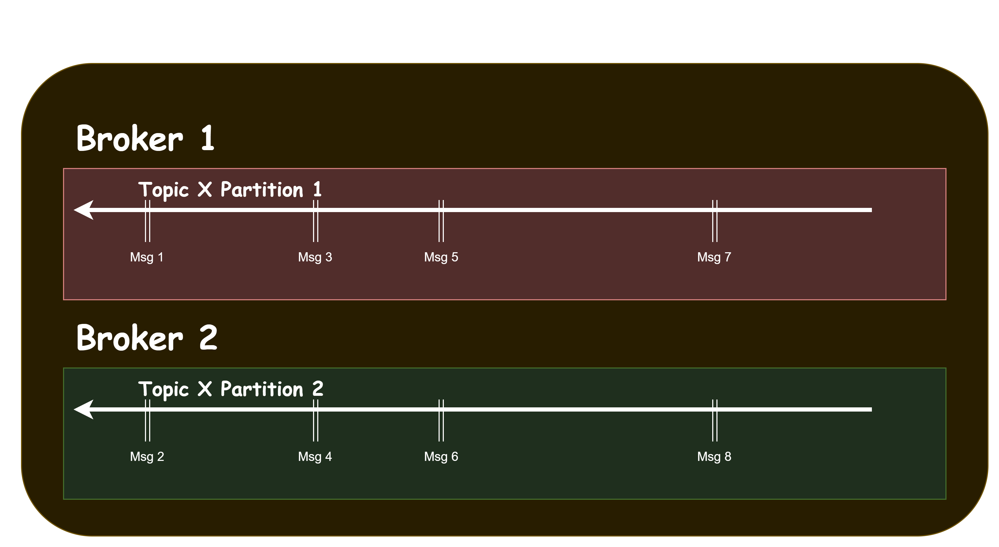
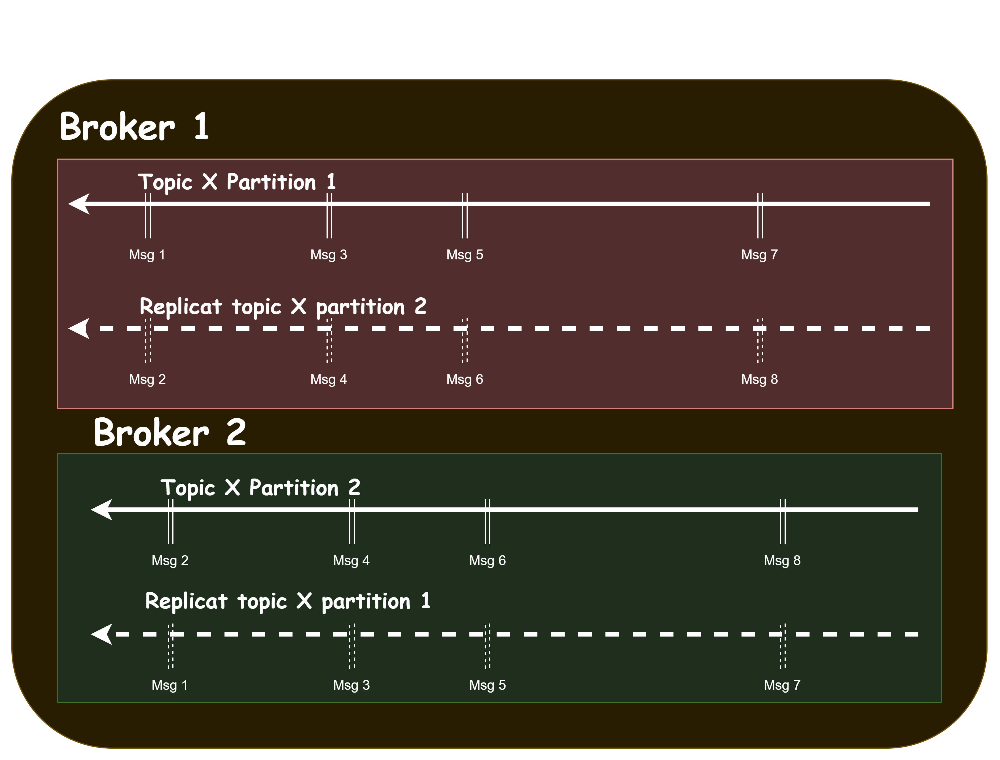
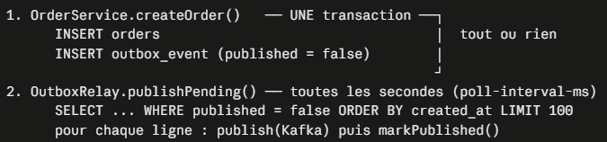
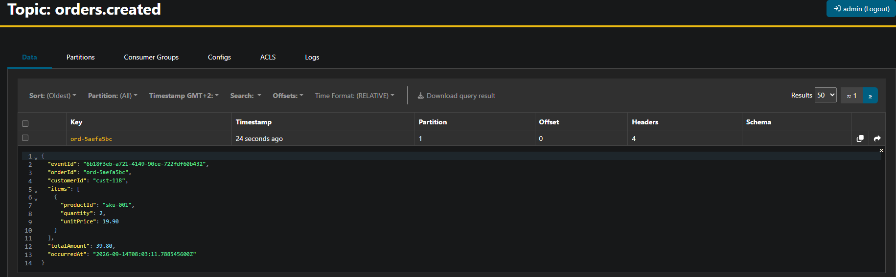
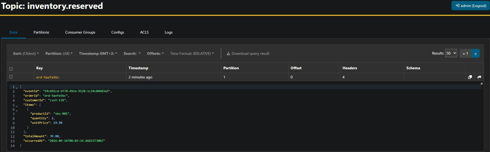

# Kafka

<details>
<summary>Définitions & concepts</summary>

- `Event`:
  - Description d'une action (ex métier: passage d'une commande, d'un payment, via un site e-commerce)
  - A diffuser à un ou plusieurs microservices
  - Stockés sous forme de messages
  - Stockés dans une couche logique nommée topics
- `Event Streaming` : Diffusion d'événements en continu
- `Producer` (écriture)
  - Application cliente qui écrit des données
  - Dans un ou des topics
- `Consumer` (lecture)
  - Application client qui souscrit à des topics
- `Asynchrone`
  - Découplage entre l'activité du/des producers
  - Découplage entre l'activité et du/des consumers
- `Topics`
  - Une couche logique de stockage des messages
  - Permettant de lire et de relire les messages
  - Les messages ne sont pas détruits
- `Commit log`
  - Méthode employée par Kafka pour stocker les messages
  - Ordonnée, séquentiel et jamais détruit lors de leur consommation
- `Offset`
  - Caractéristiques : où commencer (plus tôt ou plus tard)
  - Important pour attester de la bonne délivrance du message
- `Partition`
  - Fragmentation logique des topics en morceau
  - Permet de distribuer sur l'ensemble d'un même cluster
  - En les conservant dans le même topic
  - Important pour la performance et la scalabilité

_Exemple de cluster partitionné_



- `Clef de partition`
  - Information utilisée pour déterminer où stocker
  - Défini dans quelle partition
  - Fonction de hachage
- `Segment` (partition découpé)
  - au sein des partitions
  - regroupement de messages pour un stockage physique
  - valeur par défaut = 1GB
- `Réplication`
  - Les partitions sont dupliquées (haute disponibilité)
  - Sur un ou plusieurs autre serveurs (brokers)
  - Leader vs Follower (Broker principal ou secondaire)

Exemple de cluster partitionné avec Replicat



- `Consumer Group`, à la différence des producers dont le travail est plus simple :
  - Les consumers doivent s'organiser pour consommer les partitions
  - Potentiellement de différents topics
  - Un des brokers à en charge de coordonner (coordinator)
    - coordinator est en charge de l'offset

</details>

## Démarrage

Le même code tourne dans deux modes : choisis celui qui correspond à ton poste. **Java 25** est la version de référence dans les deux cas (AKHQ 0.28.0 l'exige).

|                      | Avec droits administrateur                                              | Sans droits administrateur                            |
| -------------------- | ----------------------------------------------------------------------- | ----------------------------------------------------- |
| Kafka 4.3.1 (KRaft)  | conteneur `apache/kafka:4.3.1`                                          | archive `kafka_2.13-4.3.1.tgz` lancée à la main       |
| AKHQ 0.28.0          | conteneur `tchiotludo/akhq:0.28.0`                                      | `akhq-0.28.0-all.jar` (Java 25)                       |
| Services Spring Boot | conteneurs construits par la [`Dockerfile`](Dockerfile), ou IDE / `mvn` | IDE ou `mvn spring-boot:run`                          |
| Bases H2             | un volume Docker par service                                            | un fichier par service dans le répertoire utilisateur |
| Tests                | `mvn clean verify` (`@EmbeddedKafka`, sans Docker)                      | `mvn clean verify` (identique)                        |

Les ports sont les mêmes dans les deux modes (Kafka `9092`, services `8081` à `8085`, AKHQ `8090`, et Jaeger `16686` si tu le démarres) : ne fais pas tourner les deux en même temps.

<details>
<summary>Démarrage avec droits administrateur (Docker)</summary>

### Prérequis

- Docker Desktop (Windows, macOS) ou Docker Engine avec le plugin Compose (Linux).
- Pour lancer les services depuis l'IDE ou lancer les tests : un JDK 25 et Maven, comme dans le mode sans droits administrateur. Pour tout faire tourner en conteneurs, Docker suffit.

### Tout démarrer en conteneurs

```bash
docker compose up -d --build
```

Le premier lancement construit les images des 4 services : la compilation Maven se fait dans un conteneur `maven:3.9-eclipse-temurin-25`, puis chaque service tourne sur une image `eclipse-temurin:25-jre`. Les services attendent que Kafka soit prêt (healthcheck) avant de démarrer.

| Adresse                                                | Composant                                             |
| ------------------------------------------------------ | ----------------------------------------------------- |
| `http://localhost:8081/api/orders`                     | order-service                                         |
| `http://localhost:8082/api/stock`                      | inventory-service                                     |
| `http://localhost:8083`                                | payment-service                                       |
| `http://localhost:8084`                                | notification-service                                  |
| `http://localhost:8085/api/analytics/orders-by-status` | analytics-service (phase 8, bonus)                    |
| `http://localhost:16686`                               | Jaeger, traces (phase 5, profil `tracing`, optionnel) |
| `http://localhost:8090`                                | AKHQ (cluster `orderflow-docker`)                     |
| `localhost:9092`                                       | Kafka, depuis le poste (IDE, CLI)                     |

```bash
docker compose ps                            # état des conteneurs, Kafka doit être "healthy"
docker compose logs -f order-service         # logs d'un service
docker compose up -d --build order-service   # reconstruire un service après une modification du code
```

### Infra seule, services lancés depuis l'IDE

```bash
docker compose up -d kafka akhq
```

Lance ensuite les services depuis l'IDE (configurations Spring Boot d'IntelliJ ou `launch.json` de VS Code) ou avec `mvn -pl <service> spring-boot:run`. Ils trouvent Kafka sur `localhost:9092` et leur base H2 dans le répertoire utilisateur : `application.yml` ne change pas.

### Bases H2

Console `http://localhost:8081/h2-console` (8082 pour inventory, 8083 pour payments), utilisateur `sa`, sans mot de passe, JDBC URL `jdbc:h2:file:/data/orders;AUTO_SERVER=TRUE;MODE=PostgreSQL` (remplacer `orders` par `inventory` ou `payments`).

### Arrêter, repartir de zéro

```bash
docker compose down      # arrête les conteneurs, garde les données (volumes)
docker compose down -v   # arrête et efface les données Kafka et les bases H2
```

Phase 3 du TODO (outbox face à une panne du broker) : `docker compose stop kafka`, poste des commandes, puis `docker compose start kafka`.

### Réglages du `docker-compose.yml` (variables d'environnement)

Toutes ont une valeur par défaut : `docker compose up -d` sans rien changer donne le comportement décrit dans les phases 1 à 3.

| Variable                               | Défaut  | Effet                                                                                                                                | Phase |
| -------------------------------------- | ------- | ------------------------------------------------------------------------------------------------------------------------------------ | ----- |
| `ORDERFLOW_PAYMENT_TRANSIENT_FAILURES` | `0`     | les N premiers appels au prestataire de paiement, pour chaque commande, échouent : `2` → topics de retry, `5` → Dead Letter Topic    | 4     |
| `ORDERFLOW_TRACING_EXPORT`             | `false` | `true` : les services exportent leurs traces vers Jaeger (à lancer avec `--profile tracing`, interface sur `http://localhost:16686`) | 5     |
| `ORDERFLOW_VIRTUAL_THREADS`            | `false` | `true` : threads virtuels (Tomcat, listeners Kafka, tâches planifiées)                                                               | 9     |
| `ORDERFLOW_KAFKA_SESSION_TIMEOUT_MS`   | `45000` | délai après lequel un consumer tué brutalement est déclaré mort ; `10000` accélère la reprise après un arrêt brutal                  | 9     |

```bash
ORDERFLOW_PAYMENT_TRANSIENT_FAILURES=2 docker compose up -d payment-service
ORDERFLOW_TRACING_EXPORT=true docker compose --profile tracing up -d
```

PowerShell : `$env:ORDERFLOW_PAYMENT_TRANSIENT_FAILURES='2'; docker compose up -d payment-service`.

### Compiler et tester sans JDK sur le poste

```bash
docker run --rm -v "${PWD}:/workspace" -v orderflow-m2:/root/.m2 -w /workspace maven:3.9-eclipse-temurin-25 mvn -B clean verify
```

PowerShell ou bash, depuis la racine du dépôt. Le volume `orderflow-m2` garde le cache Maven entre deux exécutions.

### Ce que fait la configuration Docker

- [`docker-compose.yml`](docker-compose.yml) : Kafka en KRaft mono-nœud (3 partitions par défaut, réplication 1), AKHQ, les 4 services et leurs volumes.
- [`Dockerfile`](Dockerfile) : une seule image paramétrée par `SERVICE`, build Maven puis JRE 25, utilisateur non root.
- Le broker expose deux listeners : `kafka:29092` pour les conteneurs, `localhost:9092` pour le poste.
- Les `application.yml` ne changent pas : `docker-compose.yml` surcharge `spring.kafka.bootstrap-servers` et `spring.datasource.url` par variables d'environnement (l'URL H2 y porte `WRITE_DELAY=0`, voir [phase 9](#phase-9--exactly-once-chaos-testing-virtual-threads-bonus)).
- Sous VS Code : tâches « Docker : tout demarrer », « Docker : Kafka + AKHQ seuls », « Docker : logs » et « Docker : arreter ».

</details>

<details>
<summary>Démarrage sans droits administrateur</summary>

Tout tourne depuis le répertoire utilisateur : archives décompressées, aucun installeur, aucun service Windows. Procédure détaillée : [dossier technique, §12](Docs/TD/02-dossier-technique-fonctionnel-orderflow.md#12-installation-locale).

### Prérequis : un JDK 25

Archive `.zip` (Windows) ou `.tar.gz` (Linux, macOS) d'Eclipse Temurin 25, décompressée dans ton répertoire utilisateur. Pas d'installeur. Java 25 est requis par AKHQ 0.28.0.

```bash
java -version   # doit afficher 25.x
```

### Prérequis : Maven

Le projet est livré **sans Maven Wrapper**. Deux options, toutes deux sans droits admin :

1. **Maven portable** — décompresser `apache-maven-3.9.16-bin.zip` et ajouter son `bin` au `PATH` utilisateur.
2. **Générer le wrapper** une fois Maven disponible, puis n'utiliser que lui :

   ```bash
   mvn -N wrapper:wrapper -Dmaven=3.9.16
   ```

   Tu obtiens `mvnw` / `mvnw.cmd`, et Maven n'a plus besoin d'être installé.

> Si ton réseau d'entreprise filtre Maven Central, configure le proxy dans `~/.m2/settings.xml` avant la première build. C'est le blocage le plus fréquent sur poste bridé.

> ZooKeeper n'est plus nécessaire : Kafka 4.x fonctionne uniquement en mode KRaft.

### Installer Kafka 4.3.1 (KRaft)

- Télécharger Kafka [quickstart](https://kafka.apache.org/43/getting-started/quickstart/)
- Décompresser le sous C:/ (Attention ne fonctionne pas si le chemin est trop long)
- Exécuter les commande dans un terminal Windows command prompt

```sh
for /f "tokens=*" %i in ('bin\windows\kafka-storage.bat random-uuid 2^>nul') do set KAFKA_CLUSTER_ID=%i
set KAFKA_CLUSTER_ID=random-uuid retourné précedemment
# Vérification
echo %KAFKA_CLUSTER_ID%
# Retourne random-uuid retourné précedemment
bin\windows\kafka-storage.bat format --standalone -t %KAFKA_CLUSTER_ID% -c config\server.properties
# doit retourner Formatting dynamic metadata voter directory /tmp/kraft-combined-logs with metadata.version 4.3-IV0.
```

- Configuration cluster et noeuf Kafka. Ouvrir pour modifier/ contrôler la configuration kafka dans le fichier `config/server.properties` ou (et) `controller.properties` ou (et) `broker.properties` (Exemple : [server.properties](Docs/server.properties)) :

| Paramètre                                                 | Définition                                                                                                                                                                                                                                                                                                                                      | Type    | Défaut                                           |
| --------------------------------------------------------- | ----------------------------------------------------------------------------------------------------------------------------------------------------------------------------------------------------------------------------------------------------------------------------------------------------------------------------------------------- | ------- | ------------------------------------------------ |
| `log.dirs`                                                | Liste de répertoires (séparés par des virgules) où sont stockées les données de log. Si absent, la valeur de `log.dir` est utilisée.                                                                                                                                                                                                            | list    | `null` (repli sur `log.dir` = `/tmp/kafka-logs`) |
| `num.partitions`                                          | Nombre par défaut de partitions par topic. S'applique à la création automatique de topics, à la création de topics internes de Kafka Streams, et à `AdminClient#createTopics` quand le nombre de partitions vaut -1.                                                                                                                            | int     | `1`                                              |
| `default.replication.factor`                              | Facteur de réplication par défaut par topic, utilisé dans les mêmes cas que `num.partitions` (création auto, topics internes Streams, `AdminClient#createTopics`).                                                                                                                                                                              | int     | `1`                                              |
| `min.insync.replicas`                                     | Nombre minimal de réplicas synchronisés (ISR), leader inclus, requis pour qu'une écriture réussisse quand un producer utilise `acks=all`. Si l'ISR contient moins de membres que cette valeur, le producer reçoit une exception.                                                                                                                | int     | `1`                                              |
| `log.retention.hours`                                     | Nombre d'heures de conservation d'un fichier de log avant suppression ; paramètre tertiaire par rapport à `log.retention.ms`.                                                                                                                                                                                                                   | int     | `168`                                            |
| `log.segment.bytes`                                       | Taille maximale d'un seul fichier de segment de log.                                                                                                                                                                                                                                                                                            | int     | `1073741824` (1 GiB)                             |
| `log.retention.check.interval.ms`                         | Fréquence (en ms) à laquelle le nettoyeur de logs vérifie si des logs sont éligibles à la suppression.                                                                                                                                                                                                                                          | long    | `300000` (5 min)                                 |
| `zookeeper.connect` _(supprimé depuis 4.0)_               | Chaîne de connexion au cluster ZooKeeper, au format `host:port`, avec possibilité de lister plusieurs hôtes (`host1:port1,host2:port2,...`) et d'ajouter un chemin _chroot_ (`/chemin`) pour isoler les données du cluster dans le namespace ZooKeeper.                                                                                         | list    | —                                                |
| `zookeeper.connection.timeout.ms` _(supprimé depuis 4.0)_ | Délai maximal (en ms) pour que le client établisse une connexion à ZooKeeper. Si non défini, reprend la valeur de `zookeeper.session.timeout.ms` (18000 ms).                                                                                                                                                                                    | int     | —                                                |
| `auto.create.topics.enable`                               | Active la création automatique de topics côté serveur.                                                                                                                                                                                                                                                                                          | boolean | `true`                                           |
| `broker.id`                                               | Identifiant du broker pour ce serveur.                                                                                                                                                                                                                                                                                                          | int     | `-1`                                             |
| `advertised.listeners`                                    | Adresses des listeners que les brokers annoncent aux clients et aux autres brokers — utile quand `listeners` ne représente pas les adresses réellement joignables par les clients (ex. environnements cloud/NAT). Si absent, la valeur de `listeners` est utilisée. Contrairement à `listeners`, ne peut pas annoncer l'adresse méta `0.0.0.0`. | list    | `null`                                           |
| `delete.topic.enable`                                     | Quand `true`, les topics peuvent être supprimés via l'admin client ; quand `false`, les requêtes de suppression sont explicitement rejetées par le broker.                                                                                                                                                                                      | boolean | `true`                                           |

### Démarrer Kafka et AKHQ

```bash
scripts\start-kafka.cmd   # Windows : broker Kafka (KAFKA_HOME, défaut C:\kafka_2.13-4.3.1)
scripts/start-kafka.sh    # Linux, macOS : broker Kafka (KAFKA_HOME, défaut ~/dev/kafka_2.13-4.3.1)
scripts/start-akhq.sh     # AKHQ sur http://localhost:8090 (AKHQ_HOME, défaut ~/dev/akhq)
```

La configuration d'AKHQ à copier à côté du JAR est [`scripts/akhq-application.yml`](scripts/akhq-application.yml). Sous VS Code : tâche « Kafka : demarrer le broker ».

### Compiler et tester

```bash
mvn clean verify
```

Aucun service externe n'est nécessaire : les tests d'intégration démarrent un broker Kafka dans la JVM (`@EmbeddedKafka`) et utilisent H2.

### Lancer les services

Kafka démarré, quatre terminaux (ou lance seulement ce dont tu as besoin) :

```bash
mvn install -DskipTests                        # une fois : installe orderflow-common dans ~/.m2
mvn -pl order-service        spring-boot:run   # :8081
mvn -pl inventory-service    spring-boot:run   # :8082
mvn -pl payment-service      spring-boot:run   # :8083
mvn -pl notification-service spring-boot:run   # :8084
mvn -pl analytics-service    spring-boot:run   # :8085 (phase 8, bonus : exige transaction.state.log.replication.factor=1 et min.isr=1 sur le broker)
```

Ou depuis l'IDE : configurations Spring Boot d'IntelliJ, ou `launch.json` de VS Code (« OrderFlow : tous les services »).

</details>

## TD

<details>
<summary>Travaux Dirigés</summary>

## OrderFlow — squelette sans Kafka

Cas d'école événementiel. **Toute la logique métier est écrite et testée ; la couche Kafka est à toi.** Voir [`TODO-KAFKA.md`](TODO-KAFKA.md).

- **Java 25** · **Spring Boot 4.1.1** · **H2 embarqué** · **Maven** · **Lombok** (constructeurs, getters, loggers)
- Deux modes de démarrage pour le même code : sans droits administrateur (tout depuis le répertoire utilisateur) ou avec droits administrateur (Docker Compose) — voir [Démarrage](#démarrage)

---

### Démarrer

Les deux procédures, avec ou sans droits administrateur, sont décrites dans la rubrique [Démarrage](#démarrage) en tête de ce README.

#### Essayer

```bash
curl -X POST http://localhost:8081/api/orders -H "Content-Type: application/json" -d "{\"customerId\":\"cust-118\",\"items\":[{\"productId\":\"sku-001\",\"quantity\":2}]}"
```

Dans la console d'`order-service`, tu verras la ligne d'outbox partir :

```text
[NO-BROKER] topic=orders.created key=ord-3f2a1b8c headers={eventId=..., eventType=OrderCreated, ...} payload={...}
```

C'est exactement le message que Kafka transportera : topic, clé de partition, en-têtes, payload. Il ne va nulle part aujourd'hui — c'est ce que tu vas brancher, en écrivant un `EventPublisher` et en basculant la propriété `orderflow.messaging.publisher` sur `kafka`.

Voir aussi les requêtes prêtes à l'emploi dans [`http/`](http/).

---

### Architecture

```text
orderflow-common/          Contrats partagés : événements, topics, port EventPublisher
order-service/       :8081 Source de vérité de la commande + outbox transactionnel
inventory-service/   :8082 Réservation, rejet, compensation du stock
payment-service/     :8083 Encaissement simulé (déterministe)
notification-service/:8084 Notification client (sans état)
analytics-service/   :8085 Agrégats temps réel avec Kafka Streams (bonus, sans base : état dans RocksDB)
```

Chaque service a **sa propre base H2** : un fichier dans le répertoire utilisateur (sans droits admin) ou un volume Docker dédié (avec droits admin). Aucune base partagée : c'est la règle qui rend l'architecture événementielle nécessaire plutôt que décorative.

#### Les deux scénarios à connaître

| Commande                  | Résultat    | Ce que ça exerce                                    |
| ------------------------- | ----------- | --------------------------------------------------- |
| `sku-001` × 2 → 39,80 €   | `CONFIRMED` | Parcours nominal complet                            |
| `sku-005` × 1 → 1250,00 € | `CANCELLED` | Refus de paiement + **compensation du stock**       |
| `sku-005` × 5             | `CANCELLED` | Rejet stock (il n'y en a que 2) — sans compensation |

Le simulateur de paiement refuse au-delà de 1000 € — règle déterministe, configurable via `orderflow.payment.refusal-threshold`.

---

### Consulter les données

Console H2 sur chaque service : `http://localhost:8081/h2-console` (8082 inventory, 8083 payments), utilisateur `sa`, pas de mot de passe. JDBC URL :

- sans droits admin : la valeur de `spring.datasource.url` du service, par exemple `jdbc:h2:file:~/Users/jeanyves.ruffin/orderflow-data/orders;AUTO_SERVER=TRUE;MODE=PostgreSQL` ;
- avec droits admin (Docker) : `jdbc:h2:file:/data/orders;AUTO_SERVER=TRUE;MODE=PostgreSQL`.

Tables intéressantes :

- `orders`, `order_items`, **`outbox_event`** (côté order)
- `stock`, **`processed_events`**, **`stock_reservation`** (côté inventory)
- `payments`, `processed_events` (côté payment)

Le contenu de `outbox_event` et `processed_events` est le meilleur support pour comprendre les patterns avant même d'avoir branché Kafka.

---

### Points de vigilance Spring Boot 4

Le projet cible Boot 4.1.1, qui introduit deux ruptures par rapport à Boot 3 :

**Starters modulaires.** `spring-boot-starter-web` est devenu `spring-boot-starter-webmvc`, `spring-boot-starter-json` est devenu `spring-boot-starter-jackson`, et `spring-boot-starter-test` a été éclaté en starters par technologie. Les anciens noms existent encore mais sont dépréciés. Le `pom.xml` parent documente un filet de sécurité (`spring-boot-starter-classic`) si un starter modulaire posait problème.

**Jackson 3.** Le bean auto-configuré n'est plus `com.fasterxml.jackson.databind.ObjectMapper` mais `tools.jackson.databind.json.JsonMapper`, immuable et thread-safe. Les exceptions sont non checkées, et les types `java.time` sont sérialisés en ISO-8601 nativement, sans module à enregistrer. Les annotations, elles, restent dans `com.fasterxml.jackson.annotation`.

**Côté tests**, si tu ajoutes des tranches (`@WebMvcTest`, `@DataJpaTest`), sache que `@MockBean` a disparu au profit de `@MockitoBean`, que `@SpringBootTest` ne configure plus MockMvc automatiquement, et que `@WebMvcTest` demande désormais le starter `spring-boot-starter-webmvc-test`. Les tests livrés évitent volontairement ces API : ce sont des tests unitaires purs, JUnit 5 + Mockito.

---

### Honnêteté sur ce livrable

Je n'ai **pas pu compiler ce projet** : mon environnement n'a pas accès à Maven Central. Le code est écrit avec soin et les versions sont vérifiées, mais la zone la plus susceptible de demander un ajustement est le nom exact de certains starters Boot 4 dans les `pom.xml`. Si un starter ne résout pas, le bloc `spring-boot-starter-classic` documenté dans le pom parent te débloque en une minute.

La logique métier, elle, est du Java standard et ne dépend d'aucune de ces subtilités.

</details>

<details>
<summary>Travaux Dirigés - Réalisation</summary>

## [Phase 1 — Premier flux Order → Inventory](TODO-KAFKA.md#phase-1)

- Ajouter les dépendances nécessaires pour implementer Kafka Spring `spring-kafka` dans `pom.xml` ainsi que l'ajout les paramètres dans `application.yml`

```xml
<dependency>
    <groupId>org.springframework.boot</groupId>
    <artifactId>spring-boot-starter-kafka</artifactId>
</dependency>
<dependency>
    <groupId>org.springframework.kafka</groupId>
    <artifactId>spring-kafka-test</artifactId>
    <scope>test</scope>
</dependency>
```

```yaml
spring:
  kafka:
    bootstrap-servers: localhost:9092
    producer:
      key-serializer: org.apache.kafka.common.serialization.StringSerializer
      value-serializer: org.apache.kafka.common.serialization.StringSerializer
      acks: all
      properties:
        enable.idempotence: true
    consumer:
      group-id: order-service
      auto-offset-reset: earliest
      enable-auto-commit: false
      key-deserializer: org.apache.kafka.common.serialization.StringDeserializer
      value-deserializer: org.apache.kafka.common.serialization.StringDeserializer
    listener:
      ack-mode: record
    admin:
      fail-fast: true
orderflow:
  messaging:
    publisher: kafka
  outbox:
    poll-interval-ms: 1000
```

- Ajout des `Publisher` Kafka, un par service producteur, en lieu et place du LoggingEventPublisher [LoggingEventPublisher.java](orderflow-common/src/main/java/fr/orderflow/common/messaging/LoggingEventPublisher.java) : [KafkaEventOrderPublisher.java](order-service/src/main/java/fr/orderflow/order/messaging/KafkaEventOrderPublisher.java), [KafkaEventInventoryPublisher.java](inventory-service/src/main/java/fr/orderflow/inventory/messaging/KafkaEventInventoryPublisher.java) et, en phase 2, [KafkaEventPaymentPublisher.java](payment-service/src/main/java/fr/orderflow/payment/messaging/KafkaEventPaymentPublisher.java). Chacun doit :

  - être un `@Component` pour que Spring le détecte comme un bean et le construit au runtime.
  - implémente `EventPublisher`, qui est déja prévu pour surcharger une méthode retournant topic key headers payload, qui seront nécessaires au `Publisher` Kafka.
  - définir la variable de type [ProducerRecord](https://kafka.apache.org/43/javadoc/org/apache/kafka/clients/producer/ProducerRecord.html) qui permet de créer des enregistrements.
  - ajouter à la variable de type `ProducerRecord` la liste contenu du header, au besoin.
  - envoi le `message` dans un `topic`.
  - **attendre l'acquittement du broker** (`send(...).get(timeout)`) : l'envoi doit être synchrone. Un simple `send(...)` rend la main tout de suite, et un refus du broker passerait inaperçu :

    - côté order-service, le relais d'outbox marquerait la ligne publiée alors que rien n'est parti ;
    - côté inventory-service et payment-service, qui publient depuis leur transaction, la réservation (ou le paiement) serait validée sans que l'événement parte, et la saga resterait bloquée.

    Avec l'envoi synchrone, l'exception empêche le `markPublished` (order) ou annule la transaction (inventory, payment) : le message entrant est relu et rien n'est perdu (NF-01).

  - La valeur du paramètre `orderflow.messaging.publisher` doit être `kafka` (vs logging initialement).
  - Exemple de `Publisher` :

```java
@Component
@ConditionalOnProperty(name = "orderflow.messaging.publisher", havingValue = "kafka")
public class KafkaEventOrderPublisher implements EventPublisher {

    private static final long SEND_TIMEOUT_SECONDS = 10;

    private final KafkaTemplate<String, String> kafkaTemplate;

    public KafkaEventOrderPublisher(KafkaTemplate<String, String> kafkaTemplate) {
        this.kafkaTemplate = kafkaTemplate;
    }


    @Override
    public void publish(EventEnvelope envelope) {

        ProducerRecord<String, String> stringStringProducerRecord = new ProducerRecord<>(
                envelope.topic(),
                envelope.key(),
                envelope.payload());

        envelope.headers()
                .forEach((stringKey, stringValue) -> stringStringProducerRecord.headers()
                        .add(stringKey, stringValue.getBytes(StandardCharsets.UTF_8)));

        try {
            kafkaTemplate.send(stringStringProducerRecord)
                    .get(SEND_TIMEOUT_SECONDS, TimeUnit.SECONDS);
        } catch (InterruptedException e) {
            Thread.currentThread()
                    .interrupt();
            throw new KafkaException("Envoi interrompu topic=" + envelope.topic(), e);
        } catch (ExecutionException e) {
            throw new KafkaException(
                    "Envoi refuse par le broker topic=" + envelope.topic() + " : " + e.getCause()
                            .getMessage(), e.getCause());
        } catch (TimeoutException e) {
            throw new KafkaException(
                    "Pas d'acquittement du broker sous " + SEND_TIMEOUT_SECONDS + " s topic=" + envelope.topic(), e);
        }
    }
}
```

- Ajout des `Listens` nécessaires pour la deserialisation et delegation à `KafkaListener`. _Chaque méthode (onReserved, onReject) gère un événement spécifique d'un topic distinct._ Les méthodes doivent :
  - être un `@Component`. La classe doit être enregistrée comme un bean Spring pour que le conteneur puisse détecter automatiquement les méthodes annotées pour l'écoute.
  - être un `@ConditionalOnProperty`. Permet de s'assurer de la presence et utilisation et la propriété : `orderflow.messaging.publisher: kafka`
  - avoir des méthodes annotées `@KafkaListener` transforme une méthode en consommateur Kafka. Elle prend généralement en paramètre :
    - `topics` : Le ou les sujets Kafka écoutés.
    - `groupId` : L'identifiant du groupe de consommateurs (essentiel pour la répartition des charges et le suivi des offsets).
  - L'extraction du payload et des métadonnées (`@Payload` et `@Header`) : Permet de désosser le message entrant. `@Payload` récupère le corps brut du message (souvent du JSON), tandis que `@Header` extrait les métadonnées cruciales (comme le `correlationId` pour le traçage distribué ou l'`ID` de l'événement).
  - La désérialisation du message : Convertit la chaîne brute (ou les octets) du payload en un objet typé Java (ex: `InventoryReservedEvent`) via un composant dédié (comme votre `EventSerializer`).
  - La délégation au service métier (Service Layer) : Le listener ne doit pas contenir de logiques métiers. Son rôle se limite à recevoir, décoder et transmettre. Il délègue immédiatement le traitement à un service (ex : `OrderService`) en lui passant les données extraites. _L'injection des dépendances (OrderService, EventSerializer) se fait via le constructeur._
- Exemple de `Listens` :

```java
@Component
public class InventoryEventListener {

    private final OrderService orderService;

    private final EventSerializer eventSerializer;

    public InventoryEventListener(OrderService orderService, EventSerializer eventSerializer) {
        this.orderService = orderService;
        this.eventSerializer = eventSerializer;
    }

    @KafkaListener(topics = Topics.INVENTORY_RESERVED, groupId = "order-service")
    public void onReserved(@Payload String payload, @Header(EventHeaders.CORRELATION_ID) String correlationId) {
        var event = eventSerializer.fromJson(payload, InventoryReservedEvent.class);
        orderService.onInventoryReserved(event.orderId(), correlationId);
    }

    @KafkaListener(topics = Topics.INVENTORY_REJECTED, groupId = "order-service")
    public void onReject(@Payload String payload, @Header(EventHeaders.CORRELATION_ID) String correlationId) {
        var event = eventSerializer.fromJson(payload, InventoryRejectedEvent.class);
        orderService.onInventoryRejected(event.orderId(), event.reason(), correlationId);
    }

}
```

- Ajout des `Topics` :
  - Les noms de `Topics` (String) doivent être déclarés dans un fichier de constantes. Dans notre cas, dans le module common.
  - Pour déclarer plusieurs topics dans un seul bean, utiliser `KafkaAdmin.NewTopics`.
  - exemple de déclaration des `Topics` suivi d'un exemple de déclaration de plusieurs `Topics` dans un seul bean :

```java
public final class Topics {

    public static final String ORDERS_CREATED = "orders.created";
    public static final String ORDERS_CANCELLED = "orders.cancelled";
    public static final String ORDERS_CONFIRMED = "orders.confirmed";
    public static final String INVENTORY_RESERVED = "inventory.reserved";
    public static final String INVENTORY_REJECTED = "inventory.rejected";
    public static final String PAYMENTS_COMPLETED = "payments.completed";
    public static final String PAYMENTS_FAILED = "payments.failed";

    private Topics() {
    }
}
```

```java
@Configuration
public class KafkaTopicsOrderConfig {

    private static final int PARTITIONS = 3;
    private static final int REPLICAS = 1; // un seul broker en local

    @Bean
    public KafkaAdmin.NewTopics orderTopics() {
        return new KafkaAdmin.NewTopics(
                TopicBuilder.name(Topics.ORDERS_CREATED)
                        .partitions(PARTITIONS)
                        .replicas(REPLICAS)
                        .build(),
                TopicBuilder.name(Topics.ORDERS_CONFIRMED)
                        .partitions(PARTITIONS)
                        .replicas(REPLICAS)
                        .build(),
                TopicBuilder.name(Topics.ORDERS_CANCELLED)
                        .partitions(PARTITIONS)
                        .replicas(REPLICAS)
                        .build());
    }
}
```

- Chaque service déclare les topics qu'il **produit**. Un topic non déclaré est créé à la volée par le broker, avec ses réglages par défaut (`num.partitions`, facteur de réplication) plutôt que les nôtres :

| Service           | Classe                       | Topics                                                      |
| ----------------- | ---------------------------- | ----------------------------------------------------------- |
| order-service     | `KafkaTopicsOrderConfig`     | `orders.created`, `orders.confirmed`, `orders.cancelled`    |
| inventory-service | `KafkaTopicsInventoryConfig` | `inventory.reserved`, `inventory.rejected`                  |
| payment-service   | `KafkaTopicsPaymentConfig`   | `payments.completed`, `payments.failed` (ajouté en phase 2) |

> **Pourquoi 3 partitions plutôt que 10**
>
> **Parallélisme** : dans un `consumer group`, une partition n'est lue que par un seul `consumer`. Le nombre de partitions fixe donc le nombre maximum d'instances d'un service qui peuvent travailler en parallèle. Pour le TD, 3 suffit, et c'est la valeur par défaut de ton `broker` (`num.partitions=3`).
>
> **Ordre** : la clé du message est l'`event.orderId`. Tous les événements d'une même commande vont donc dans la même partition, dans l'ordre.
>
> **⚠️ Attention ⚠️** : on peut augmenter le nombre de partitions plus tard, mais jamais le diminuer. Et l'augmenter change la partition associée à chaque clé.

### Tests unitaires

- Configurer vos fichiers test/../application.yml :

```yaml
# inventory-service
spring:
  kafka:
    consumer:
      auto-offset-reset: earliest
orderflow:
  messaging:
    publisher: kafka
```

```yaml
# order-service
spring:
  kafka:
    consumer:
      auto-offset-reset: earliest
orderflow:
  messaging:
    publisher: kafka
  outbox:
    poll-interval-ms: 3600000
```

> ⚠️ `orderflow` est une clé racine, au même niveau que `spring`. Placée sous `spring`, la propriété devient `spring.orderflow.messaging.publisher` et n'est jamais lue.
>
> Le `application.yml` de `src/test/resources` **remplace** celui de `src/main/resources` pendant les tests : il doit contenir tout ce dont le contexte a besoin (datasource H2 en mémoire, Kafka, propriétés `orderflow`).

- `consumer.auto-offset-reset: earliest` : Permet aux listeners de ne pas rater les premiers messages. Si ce paramètre n'est pas présent, alors, le listener mettrait plusieurs secondes à rejoindre son groupe. Le message partirait alors avant, et comme aucun `auto-offset-reset` n'est défini, Kafka applique `latest` : le listener démarrerait après le message et ne le verrait jamais.
- `orderflow.messaging.publisher: kafka` : Indique que l'application doit utiliser Apache Kafka comme infrastructure de messagerie pour l'envoi de ces messages (plutot que logging)
- `orderflow.outbox.poll-interval-ms: 3600000` : il reste désactivé en test, et le test appelle `outboxRelay.publishPending()` quand il en a besoin.



- Fonctionnement de `OutboxRelay` :
  - **Étape 1** : l'événement n'est plus envoyé, il est écrit en base dans la même transaction que la commande. Soit les deux lignes existent, soit aucune. On ne peut plus avoir l'une sans l'autre.
  - **Étape 2** : le relais pousse ensuite ces lignes vers Kafka. Si Kafka est arrêté, les lignes attendent et partiront au cycle suivant, même après un redémarrage du service. Arrêt au premier échec (break) : si l'envoi de l'événement n°3 échoue, le 4 n'est pas envoyé. On préserve ainsi l'ordre des événements d'une même commande, par exemple OrderCreated avant OrderCancelled. Lots de 100 (BATCH_SIZE): après une longue panne du broker, le relais ne charge pas des milliers de lignes d'un coup. La garantie obtenue: at-least-once. Si le service plante entre l'envoi Kafka et le markPublished, la ligne est encore published = false et l'événement repart au redémarrage. On a donc au moins une livraison, parfois deux. C'est pour ça que les consommateurs doivent être idempotents : processed_events côté Inventory, transitionTo () côté Order. Tes tests « message reçu deux fois » vérifient exactement ça.
- Créer vos tests unitaires, doit être :
  - `@SpringBootTest(properties = "spring.kafka.bootstrap-servers=${spring.embedded.kafka.brokers}")` : Il contient l'adresse (hôte et port, ex: localhost:12345) du ou des serveurs Kafka (brokers) fictifs démarrés dynamiquement en mémoire pour les besoins des tests d'intégration.
  - `@EmbeddedKafka(partitions = 3, topics = {Topics.ORDERS_CREATED, Topics.ORDERS_CANCELLED, Topics.INVENTORY_RESERVED, Topics.INVENTORY_REJECTED})` : indique que chacun des topics déclarés sera créé avec 3 partitions. Indique au broker intégré quels topics il doit créer automatiquement dès son démarrage.
  - `@DirtiesContext` : garantit qu'on repart d'une feuille blanche (nouveau conteneur Spring, nouveau broker Kafka arrêté et relancé).
- Tests de la phase 1 :

| Classe de test                     | Type                                 | Ce qui est vérifié                                                                                                             |
| ---------------------------------- | ------------------------------------ | ------------------------------------------------------------------------------------------------------------------------------ |
| `OrderServiceTest`                 | unitaire (Mockito)                   | commande + ligne d'outbox dans la même transaction ; annulation avec les lignes à compenser ; idempotence ; état terminal      |
| `InventoryServiceTest`             | unitaire (Mockito)                   | réservation, rejet, idempotence, compensation (+ phase 2 : annuler une commande rejetée ne libère pas le stock des autres)     |
| `KafkaEventOrderPublisherTest`     | unitaire (`KafkaTemplate` bouchonné) | clé et en-têtes transmis ; un refus du broker lève une exception                                                               |
| `KafkaEventInventoryPublisherTest` | unitaire (`KafkaTemplate` bouchonné) | idem pour inventory-service (ajouté avec le passage à l'envoi synchrone)                                                       |
| `EmbeddedKafkaOrderTest`           | intégration `@EmbeddedKafka`         | relais d'outbox → `orders.created` ; `inventory.reserved` / `inventory.rejected` font avancer la commande                      |
| `EmbeddedKafkaInventoryTest`       | intégration `@EmbeddedKafka`         | `orders.created` → réservation + `inventory.reserved` ; stock insuffisant → `inventory.rejected` ; redélivrance ; compensation |

### DOD Phase 1

> Un POST /api/orders fait bouger le stock dans GET /api/stock, et que tu vois les messages passer dans AKHQ

 

## [Phase 2 — Payment + saga complète](TODO-KAFKA.md#phase-2)

La saga est **chorégraphiée** : aucun service n'appelle les autres, chacun réagit aux événements qu'il consomme et publie le suivant.

| Service              | Listener (package `messaging`) | Topic(s) consommé(s)                       | Méthode appelée                                                     | Publie                                                  |
| -------------------- | ------------------------------ | ------------------------------------------ | ------------------------------------------------------------------- | ------------------------------------------------------- |
| inventory-service    | `OrderEventListener`           | `orders.created`                           | `inventoryService.handleOrderCreated(event, correlationId)`         | `inventory.reserved` ou `inventory.rejected`            |
| inventory-service    | `OrderEventListener`           | `orders.cancelled`                         | `inventoryService.handleOrderCancelled(event)` (compensation)       | —                                                       |
| payment-service      | `InventoryEventListener`       | `inventory.reserved`                       | `paymentService.handleInventoryReserved(event, correlationId)`      | `payments.completed` ou `payments.failed`               |
| order-service        | `InventoryEventListener`       | `inventory.reserved`, `inventory.rejected` | `orderService.onInventoryReserved(...)`, `onInventoryRejected(...)` | `orders.cancelled` si rejet (via l'outbox)              |
| order-service        | `PaymentEventListener`         | `payments.completed`, `payments.failed`    | `orderService.onPaymentCompleted(...)`, `onPaymentFailed(...)`      | `orders.confirmed` ou `orders.cancelled` (via l'outbox) |
| notification-service | `OrderEventListener`           | `orders.confirmed`, `orders.cancelled`     | `notificationService.notifyCustomer(event, correlationId)`          | —                                                       |

> `payments.completed` peut arriver chez order-service **avant** `inventory.reserved` : ce sont deux topics distincts, sans ordre garanti entre eux. Ce n'est pas un problème : `OrderEntity.transitionTo(...)` accepte `CREATED → CONFIRMED` et ignore ensuite toute transition depuis un état terminal.

### Payment

- Listener [InventoryEventListener.java](payment-service/src/main/java/fr/orderflow/payment/messaging/InventoryEventListener.java) sur `inventory.reserved`, groupe `payment-service` (indépendant du groupe `order-service` qui lit le même topic).
- Publisher [KafkaEventPaymentPublisher.java](payment-service/src/main/java/fr/orderflow/payment/messaging/KafkaEventPaymentPublisher.java), même modèle synchrone que celui d'order-service. **Sans lui, payment-service ne démarre pas** : `PaymentService` a besoin d'un bean `EventPublisher`, et le `LoggingEventPublisher` n'est créé que si `orderflow.messaging.publisher: logging` :

```text
No qualifying bean of type 'fr.orderflow.common.messaging.EventPublisher' available
```

- Topics `payments.*` déclarés par [KafkaTopicsPaymentConfig.java](payment-service/src/main/java/fr/orderflow/payment/messaging/KafkaTopicsPaymentConfig.java).
- `application.yml` de payment-service (notification-service reçoit le même bloc `consumer`) :

```yaml
spring:
  kafka:
    admin:
      fail-fast: true # crée ses topics au démarrage, échoue si le broker est absent
    consumer:
      auto-offset-reset: earliest
```

> Sans `auto-offset-reset: earliest`, un groupe de consommateurs qui démarre pour la première fois se place à la fin du topic (`latest`) : les événements publiés avant son premier démarrage ne seraient jamais traités.

### Notification

- [OrderEventListener.java](notification-service/src/main/java/fr/orderflow/notification/messaging/OrderEventListener.java) écoute les deux topics terminaux dans une seule méthode, et choisit le type à désérialiser grâce à l'en-tête `eventType` :

```java
@KafkaListener(topics = { Topics.ORDERS_CONFIRMED, Topics.ORDERS_CANCELLED },
        groupId = "notification-service")
public void onTerminalEvent(@Payload String payload,
                            @Header(EventHeaders.EVENT_TYPE) String eventType,
                            @Header(EventHeaders.CORRELATION_ID) String correlationId) {
    OrderFlowEvent event = switch (eventType) {
        case OrderConfirmedEvent.TYPE -> eventSerializer.fromJson(payload, OrderConfirmedEvent.class);
        case OrderCancelledEvent.TYPE -> eventSerializer.fromJson(payload, OrderCancelledEvent.class);
        default -> throw new IllegalArgumentException("Type inattendu : " + eventType);
    };
    notificationService.notifyCustomer(event, correlationId);
}
```

> Ce service n'a pas de table `processed_events` : en at-least-once, un client peut recevoir deux fois la même notification. Acceptable pour un e-mail, jamais pour un débit bancaire.

### Corrections apportées lors de l'intégration

| #   | Problème constaté                                                                      | Cause                                                                                                                  | Correction                                                                                   |
| --- | -------------------------------------------------------------------------------------- | ---------------------------------------------------------------------------------------------------------------------- | -------------------------------------------------------------------------------------------- |
| 1   | payment-service ne démarre pas                                                         | aucun `EventPublisher` Kafka dans le module                                                                            | `KafkaEventPaymentPublisher` + `KafkaTopicsPaymentConfig`                                    |
| 2   | `GET /api/orders/{id}` et `GET /api/orders` → HTTP 500 (`LazyInitializationException`) | `open-in-view: false` : la réponse est construite après la fin de la transaction, et `items` est chargé paresseusement | `@EntityGraph(attributePaths = "items")` dans `OrderRepository`                              |
| 3   | annuler une commande rejetée libère le stock réservé par d'autres commandes            | `StockEntity.release()` plafonne au stock réservé **total** du produit, toutes commandes confondues                    | table `stock_reservation` : la compensation ne libère que les réservations de cette commande |
| 4   | un événement Inventory peut être perdu                                                 | envoi « fire and forget » depuis la transaction                                                                        | envoi synchrone, comme dans order-service (voir la phase 1)                                  |
| 5   | des consumers ratent les messages publiés avant leur premier démarrage                 | pas d'`auto-offset-reset` dans payment-service et notification-service                                                 | `auto-offset-reset: earliest`                                                                |
| 6   | nommage                                                                                | `InventoryEventListen`, `notificationEventListen` (minuscule), bean `orderTopics` copié-collé dans inventory-service   | `InventoryEventListener`, `OrderEventListener`, `inventoryTopics`                            |

#### Chargement des lignes de commande

```java
public interface OrderRepository extends JpaRepository<OrderEntity, String> {

    @Override
    @EntityGraph(attributePaths = "items")
    Optional<OrderEntity> findById(String id);

    @Override
    @EntityGraph(attributePaths = "items")
    List<OrderEntity> findAll();

    @EntityGraph(attributePaths = "items")
    List<OrderEntity> findByStatus(OrderStatus status);
}
```

#### Compensation limitée à la commande annulée

Scénario du bug, avec `sku-001` (100 en stock) :

1. Commande A `sku-001 x2` : réservée (disponible 98, réservé 2).
2. Commande B `sku-001 x999` : rejetée, puis annulée. Son `OrderCancelled` porte la ligne `sku-001 x999`.
3. **Avant** : `release(999)` libérait `min(999, 2) = 2`. La réservation de A disparaissait (disponible 100, réservé 0) : le stock pouvait être vendu deux fois.
4. **Après** : aucune réservation n'est enregistrée pour B, rien n'est libéré (disponible 98, réservé 2).

```java
// InventoryService.handleOrderCreated : chaque réservation est enregistrée pour sa commande
reservationRepository.save(new ReservationEntity(
        UUID.randomUUID().toString(), event.orderId(), line.productId(), line.quantity()));

// InventoryService.handleOrderCancelled : on ne libère que ce qui a été réservé pour CETTE commande
List<ReservationEntity> reservations = reservationRepository.findByOrderId(event.orderId());
for (ReservationEntity reservation : reservations) {
    stockRepository.findById(reservation.getProductId())
            .ifPresent(stock -> stock.release(reservation.getQuantity()));
}
reservationRepository.deleteAll(reservations);
```

### Tests Phase 2

| Classe de test                   | Type                                 | Ce qui est vérifié                                                                                                                                                                                   |
| -------------------------------- | ------------------------------------ | ---------------------------------------------------------------------------------------------------------------------------------------------------------------------------------------------------- |
| `EmbeddedKafkaPaymentTest`       | intégration `@EmbeddedKafka`         | `inventory.reserved` → `payments.completed` sous le plafond, `payments.failed` au-dessus ; un message redélivré ne débite qu'une fois                                                                |
| `EmbeddedKafkaOrderTest`         | intégration `@EmbeddedKafka`         | `payments.completed` → `CONFIRMED` + `orders.confirmed` ; `payments.failed` → `CANCELLED` + `orders.cancelled` avec les lignes ; idempotence ; lecture des commandes hors transaction (correction 2) |
| `KafkaEventPaymentPublisherTest` | unitaire (`KafkaTemplate` bouchonné) | clé et en-têtes transmis ; un refus du broker lève une exception                                                                                                                                     |
| `InventoryServiceTest`           | unitaire (Mockito)                   | annuler une commande rejetée ne libère pas le stock réservé par une autre (correction 3)                                                                                                             |
| `PaymentServiceTest`             | unitaire (Mockito)                   | paiement accepté / refusé selon le plafond ; idempotence                                                                                                                                             |

- `src/test/resources/application.yml` de payment-service :

```yaml
spring:
  datasource:
    url: jdbc:h2:mem:payments-test;DB_CLOSE_DELAY=-1;MODE=PostgreSQL
  jpa:
    hibernate:
      ddl-auto: create-drop
  kafka:
    consumer:
      auto-offset-reset: earliest
orderflow:
  messaging:
    publisher: kafka
  payment:
    refusal-threshold: 1000.00
```

- Résultat de `mvn clean verify` : **33 tests, 0 échec** (order-service 13, inventory-service 12, payment-service 8).

### DOD Phase 2

> Commander `sku-001 x2` aboutit à `CONFIRMED`, et commander `sku-005 x1` (1250,00 € > plafond) aboutit à `CANCELLED` **avec le stock libéré**.

| Scénario ([`http/orders.http`](http/orders.http)) | Résultat attendu                                                                                        |
| ------------------------------------------------- | ------------------------------------------------------------------------------------------------------- |
| `sku-001 x2` (39,80 €)                            | `payments.completed` → `CONFIRMED`, `orders.confirmed` publié, notification « commande confirmée »      |
| `sku-005 x1` (1250,00 € > 1000 €)                 | `payments.failed` → `CANCELLED`, `orders.cancelled` → stock `sku-005` revenu à 2 disponibles, 0 réservé |
| `sku-005 x5`                                      | `inventory.rejected` → `CANCELLED`, stock inchangé, aucune autre réservation libérée                    |

- [x] Chaque étape de la saga couverte par les tests `@EmbeddedKafka`, service par service
- [x] Parcours « rejet de stock » vérifié de bout en bout sous Docker (jusqu'à la notification d'annulation)
- [x] Parcours nominal et refus de paiement à rejouer de bout en bout depuis la correction de payment-service

## [Phase 3 — Vérifier l'outbox et l'idempotence sous Kafka](TODO-KAFKA.md#phase-3)

Rien à coder dans cette phase : les garanties existent déjà, l'exercice est de **prouver qu'elles tiennent face à un vrai broker**.

| Garantie                                            | Où elle est implémentée                                                                                        |
| --------------------------------------------------- | -------------------------------------------------------------------------------------------------------------- |
| Aucun événement perdu si le broker est indisponible | `OutboxEventEntity` écrite dans la transaction de la commande, publiée ensuite par `OutboxRelay`               |
| Un message rejoué n'a pas d'effet double            | `processed_events` (inventory, payment) vérifiée dans la transaction ; `OrderEntity.transitionTo(...)` (order) |

Vérifiée le 8 octobre 2026 sous Docker (projet Compose isolé `orderflow-verif`, pour ne pas toucher aux volumes existants).

### Panne du broker

```bash
docker compose -p orderflow-verif stop kafka
# 3 × POST /api/orders (sku-002 x1) : le service répond 201, la commande reste CREATED
docker compose -p orderflow-verif start kafka
```

| Moment                             | Observé                                                                                             |
| ---------------------------------- | --------------------------------------------------------------------------------------------------- |
| Broker arrêté, 3 commandes postées | 3 × `HTTP 201` (`ord-9b897ba2`, `ord-7d8b63f3`, `ord-3120e34e`), statut `CREATED`, rien n'est perdu |
| Broker redémarré                   | les 3 commandes passent `CONFIRMED` (6 s, 1 s, 1 s) : le relais a republié au cycle suivant         |
| Stock `sku-002` (50 au départ)     | 47 disponibles, 3 réservés : une seule réservation par commande                                     |

### Rejeu d'un message

Le bouton « Republish » d'AKHQ relit un message et le republie à l'identique. Pour que l'étape soit reproductible en ligne de commande, l'outil [`scripts/ReplayMessage.java`](scripts/ReplayMessage.java) fait la même chose (même clé, mêmes octets de valeur, mêmes en-têtes) :

```bash
java -cp "<kafka-clients.jar>;<slf4j-api.jar>" scripts/ReplayMessage.java localhost:9092 orders.created ord-9b897ba2
# Rejoue orders.created => orders.created key=ord-9b897ba2 (origine partition 0 offset 0) -> partition 0 offset 2
```

Les jars sont dans le dossier `libs` d'une distribution Kafka ou dans `~/.m2/repository/org/apache/kafka/kafka-clients/4.2.1`. Le message est un `OrderCreated` déjà traité. Résultat côté inventory-service :

```text
InventoryService : Evenement deja traite, ignore eventId=ee8f9879-bf7d-40ab-a660-758a5ce90ad7
```

Le stock de `sku-002` reste à 47 / 3, rien n'est publié sur `inventory.reserved`, rien n'arrive en DLT.

> Cette phase sert aussi de point de départ à la phase 9 : la phase 9 met ces deux garanties sous pression (arrêts brutaux en pleine charge) et y trouve deux défauts que ces essais « propres » ne montraient pas (voir [Corrections](#corrections-apportées-lors-des-phases-4-à-9)).

## [Phase 4 — Retry et Dead Letter Topic](TODO-KAFKA.md#phase-4)

### Le problème à résoudre

Jusqu'ici, aucun service ne déclarait de gestion d'erreur côté consumer. Spring Boot applique alors son comportement par défaut : un message qui lève une exception est **rejoué 9 fois d'affilée, sans attendre, puis abandonné** avec une simple ligne de log. Un JSON illisible serait donc perdu en quelques millisecondes (violation de NF-01), et une panne passagère du prestataire de paiement serait traitée comme une panne définitive.

La phase 4 remplace ce comportement par une politique explicite :

1. **classer** l'erreur : se résorbe-t-elle en réessayant, ou non ?
2. **réessayer** les erreurs transitoires avec un backoff exponentiel ;
3. **ne jamais perdre** : un message qui épuise ses tentatives, ou dont l'erreur est définitive, part sur `<topic>.DLT` avec l'exception et son origine, prêt à être inspecté et rejoué.

### Deux mécanismes, chacun là où il convient

| Service              | Mécanisme                                                        | Topics lus                                               | Pourquoi                                                                                                                                   |
| -------------------- | ---------------------------------------------------------------- | -------------------------------------------------------- | ------------------------------------------------------------------------------------------------------------------------------------------ |
| inventory-service    | `DefaultErrorHandler` : reprises **bloquantes** (200 ms → 1,6 s) | `orders.created`, `orders.cancelled`                     | Le verrou optimiste du stock se résorbe en quelques centaines de ms, et l'**ordre** doit être préservé (voir ci-dessous)                   |
| payment-service      | **Topics de retry** non bloquants, puis DLT                      | `inventory.reserved`                                     | Un prestataire de paiement peut rester indisponible des secondes, voire des minutes : bloquer la partition arrêterait toutes les commandes |
| order-service        | `DefaultErrorHandler`                                            | `inventory.reserved`, `inventory.rejected`, `payments.*` | Erreurs surtout définitives (commande inconnue, JSON illisible)                                                                            |
| notification-service | `DefaultErrorHandler`                                            | `orders.confirmed`, `orders.cancelled`                   | Idem                                                                                                                                       |

**Pourquoi pas des topics de retry partout ?** Un message rejoué par un topic de retry arrive _après_ ceux qui le suivaient sur la partition. Pour inventory-service, c'est dangereux : si l'`orders.created` d'une commande est rejoué après son `orders.cancelled`, la compensation s'est exécutée sur une réservation qui n'existait pas encore, puis la réservation est créée : du stock reste réservé pour une commande annulée, sans que plus rien ne le libère. Le consumer bloque donc la partition quelques centaines de millisecondes, ce qui préserve l'ordre. Chez payment-service, un seul topic est lu et le traitement est idempotent par `eventId` : l'ordre ne compte pas, la disponibilité oui.

```text
inventory.reserved ──échec──> inventory.reserved-retry-0  (après 1 s)
                   ──échec──> inventory.reserved-retry-1  (après 2 s)
                   ──échec──> inventory.reserved.DLT      (+ PaymentDeadLetterHandler : log ERROR et compteur)
```

### Classification des exceptions

| Exception                                               | Classe                        | Où                | Comportement                                                |
| ------------------------------------------------------- | ----------------------------- | ----------------- | ----------------------------------------------------------- |
| `DeserializationException`                              | non retryable (défaut Spring) | tous              | DLT immédiat                                                |
| `JacksonException` (JSON illisible, « poison pill »)    | non retryable                 | tous              | DLT immédiat                                                |
| `IllegalArgumentException` (type d'événement inattendu) | non retryable                 | tous              | DLT immédiat                                                |
| `MethodArgumentResolutionException` (en-tête absent)    | non retryable (défaut Spring) | tous              | DLT immédiat                                                |
| `OrderNotFoundException`                                | non retryable                 | order-service     | DLT immédiat : réessayer ne fera pas apparaître la commande |
| `OptimisticLockingFailureException`                     | **retryable** (défaut)        | inventory-service | reprises à 200, 400, 800, 1 600 ms, puis DLT                |
| `PaymentGatewayUnavailableException`                    | **retryable**                 | payment-service   | `-retry-0` (1 s), `-retry-1` (2 s), puis DLT                |

### Code ajouté

**Support Kafka partagé** — package `fr.orderflow.common.kafka` d'`orderflow-common`. Spring Kafka y est une dépendance `optional` et la configuration n'est active qu'avec `orderflow.messaging.publisher: kafka` : le reste du module (contrats, port `EventPublisher`) reste indépendant du transport.

| Classe                                  | Rôle                                                                                                                                |
| --------------------------------------- | ----------------------------------------------------------------------------------------------------------------------------------- |
| `KafkaErrorHandling.blockingRetry(...)` | Fabrique le `DefaultErrorHandler` : backoff exponentiel, classification, publication en DLT, compteur Micrometer, `commitRecovered` |
| `KafkaRetryProperties`                  | Réglages `orderflow.kafka.retry.blocking.*` et `orderflow.kafka.retry.topics.*`                                                     |
| `DeadLetterTopics.of(...)`              | Déclare les `<topic>.DLT` (3 partitions, rétention 14 jours) de chaque topic consommé par un service                                |
| `KafkaSupportConfig`                    | `KafkaTemplate` capable d'envoyer `String` **et** `byte[]` (nécessaire pour republier les octets d'un message illisible)            |
| `Topics.dltOf(topic)`                   | Nom du DLT : `orders.created` → `orders.created.DLT`                                                                                |

Chaque service déclare ensuite, dans son package `messaging`, **un seul** bean d'erreur et ses DLT :

```java
@Configuration
@ConditionalOnProperty(name = "orderflow.messaging.publisher", havingValue = "kafka")
public class KafkaErrorHandlingInventoryConfig {

    @Bean
    DefaultErrorHandler inventoryErrorHandler(KafkaOperations<?, ?> kafkaTemplate, KafkaRetryProperties retry,
                                              ObjectProvider<MeterRegistry> meterRegistry) {
        return KafkaErrorHandling.blockingRetry(kafkaTemplate, retry.blocking(), meterRegistry.getIfAvailable());
    }

    @Bean
    KafkaAdmin.NewTopics inventoryDeadLetterTopics() {
        return DeadLetterTopics.of(Topics.ORDERS_CREATED, Topics.ORDERS_CANCELLED);
    }
}
```

> Un seul bean `CommonErrorHandler` par service : Boot l'injecte avec `getIfUnique()`. S'il y en a deux, **aucun** n'est appliqué, et les consumers retombent sans bruit sur le comportement par défaut qui jette le message.

**`ErrorHandlingDeserializer` sur tous les consumers** (`application.yml` de chaque service, et de son `src/test/resources`, qui remplace celui de `main`) :

```yaml
spring:
  kafka:
    consumer:
      key-deserializer: org.springframework.kafka.support.serializer.ErrorHandlingDeserializer
      value-deserializer: org.springframework.kafka.support.serializer.ErrorHandlingDeserializer
      properties:
        spring.deserializer.key.delegate.class: org.apache.kafka.common.serialization.StringDeserializer
        spring.deserializer.value.delegate.class: org.apache.kafka.common.serialization.StringDeserializer
```

Sans cette enveloppe, une erreur de désérialisation est levée dans la boucle de `poll()` du consumer, qui relit alors le même offset indéfiniment. Avec elle, l'erreur est transmise au conteneur de listener, qui la classe et l'envoie en DLT.

> **Limite à connaître.** Un `StringDeserializer` ne peut jamais échouer (des octets invalides deviennent des caractères de remplacement) : sur les topics JSON, cette configuration est une protection pour plus tard, pas un chemin exercé. Le `DeserializationException` est exercé pour de vrai à partir de la [phase 7](#phase-7--avro), où `orders.created` passe en Avro.

**Topics de retry de payment-service** ([`KafkaRetryTopicPaymentConfig.java`](payment-service/src/main/java/fr/orderflow/payment/messaging/KafkaRetryTopicPaymentConfig.java)) :

```java
@Bean
RetryTopicConfiguration inventoryReservedRetryTopics(KafkaOperations<?, ?> kafkaTemplate, KafkaRetryProperties retry) {
    KafkaRetryProperties.Topics topics = retry.topics();
    return RetryTopicConfigurationBuilder.newInstance()
            .includeTopic(Topics.INVENTORY_RESERVED)
            .maxAttempts(topics.maxAttempts())                       // 3 : origine + retry-0 + retry-1
            .exponentialBackoff(topics.initialInterval().toMillis(), topics.multiplier(), topics.maxInterval().toMillis())
            .suffixTopicsWithIndexValues()                           // inventory.reserved-retry-0, -retry-1
            .dltSuffix(Topics.DLT_SUFFIX)                            // inventory.reserved.DLT
            .autoCreateTopicsWith(DeadLetterTopics.PARTITIONS, DeadLetterTopics.REPLICAS)
            .notRetryOn(DeserializationException.class)
            .notRetryOn(JacksonException.class)
            .traversingCauses()                                      // le listener enveloppe la vraie cause
            .dltHandlerMethod(new EndpointHandlerMethod(PaymentDeadLetterHandler.class, "onDeadLetter"))
            .create(kafkaTemplate);
}
```

Le listener `InventoryEventListener` n'a pas changé d'une ligne : la politique est déclarée à part, par topic (le listener ne contient toujours aucune logique de reprise).

**Panne transitoire simulée** — `PaymentGatewaySimulator` : `orderflow.payment.transient-failures-per-order=N` fait échouer les **N premiers appels de chaque commande** avec une `PaymentGatewayUnavailableException`, puis laisse passer les suivants. Déterministe, donc testable. L'exception traverse `PaymentService.handleInventoryReserved`, ce qui annule sa transaction : le `processed_events` inscrit juste avant l'appel est annulé aussi, et le rejeu n'est donc pas pris pour un doublon.

| Valeur | Effet observé                                                                             |
| ------ | ----------------------------------------------------------------------------------------- |
| `0`    | aucune panne (défaut)                                                                     |
| `2`    | le message passe par `-retry-0` et `-retry-1`, le 3ᵉ appel aboutit : commande `CONFIRMED` |
| `5`    | le message épuise ses 3 tentatives et part en `inventory.reserved.DLT`                    |

### Pièges rencontrés

| Symptôme                                                                                                     | Cause                                                                                                                                                                                                               | Correction                                                                                                 |
| ------------------------------------------------------------------------------------------------------------ | ------------------------------------------------------------------------------------------------------------------------------------------------------------------------------------------------------------------- | ---------------------------------------------------------------------------------------------------------- |
| Message bien « envoyé en DLT » dans le log, mais `orders.created.DLT` reste vide                             | Depuis Spring Kafka 4, le `DeadLetterPublishingRecoverer` publie par défaut sur `<topic>-dlt` : le broker créait `payments.completed-dlt` à la volée (`Sent auto-creation request for Set(payments.completed-dlt)`) | Résolveur de destination explicite : `Topics.dltOf(topic)`, même numéro de partition                       |
| payment-service refuse de démarrer : `Either a RetryTopicSchedulerWrapper or TaskScheduler bean is required` | Les topics de retry mettent les partitions en pause jusqu'à l'échéance du message et ont besoin d'un planificateur ; Boot n'en fournit un qu'avec `@EnableScheduling`, absent ici                                   | Bean `RetryTopicSchedulerWrapper` (il initialise et arrête le planificateur avec le contexte)              |
| Test : en-tête `kafka_dlt-exception-fqcn` absent d'un message du DLT de payment                              | Les topics de retry posent `kafka_exception-*` et `kafka_original-*`, le `DefaultErrorHandler` pose `kafka_dlt-*`                                                                                                   | Lire l'en-tête qui correspond au mécanisme                                                                 |
| L'exception d'un DLT s'appelle toujours `ListenerExecutionFailedException`                                   | Le listener enveloppe l'erreur d'origine                                                                                                                                                                            | Lire `*-exception-cause-fqcn`                                                                              |
| Compteur de DLT de payment-service incrémenté par un échec d'**order-service**                               | `inventory.reserved` est lu par deux services, qui partagent donc le même `inventory.reserved.DLT`                                                                                                                  | Le handler de DLT ignore les messages dont l'en-tête `kafka_dlt-original-consumer-group` n'est pas le sien |
| Un message déjà désérialisé puis en échec (verrou optimiste) restait bloqué                                  | Le recoverer republie la valeur du `ConsumerRecord`, qui est alors un objet typé, pas des octets ni un `String`                                                                                                     | Sérialiseur dédié, voir [phase 7](#phase-7--avro)                                                          |

**Écart avec le dossier technique.** Le catalogue (§3) prévoit des topics de retry et un DLT à 1 partition. Le recoverer republie par défaut sur le **même numéro de partition** que le message d'origine : un DLT à 1 partition ferait échouer toute publication issue des partitions 1 et 2. Les DLT et topics de retry ont donc 3 partitions, comme leurs topics sources ; la rétention du DLT est de 14 jours comme prévu.

### Tests de la phase 4

| Classe de test                       | Type                         | Ce qui est vérifié                                                                                                                                                                                    |
| ------------------------------------ | ---------------------------- | ----------------------------------------------------------------------------------------------------------------------------------------------------------------------------------------------------- |
| `EmbeddedKafkaPaymentRetryTest`      | intégration `@EmbeddedKafka` | 2 pannes du prestataire : le message passe **une fois** par `-retry-0` puis `-retry-1`, jamais par le DLT ; un seul paiement `COMPLETED`, un seul `payments.completed`                                |
| `EmbeddedKafkaPaymentDeadLetterTest` | intégration `@EmbeddedKafka` | panne permanente : retry-0, retry-1 puis DLT, message intact, aucun résultat de paiement, compteur `orderflow.kafka.dlt` ; JSON illisible : DLT immédiat, aucun retry                                 |
| `EmbeddedKafkaInventoryRetryTest`    | intégration `@EmbeddedKafka` | verrou optimiste rejoué sur place puis réussite (3 appels) ; verrou jamais libéré : DLT après 4 appels, stock intact, **commande suivante traitée** ; Avro illisible et JSON illisible : DLT immédiat |
| `EmbeddedKafkaOrderDeadLetterTest`   | intégration `@EmbeddedKafka` | commande inconnue : **un seul appel**, puis DLT ; JSON illisible : DLT, service jamais appelé                                                                                                         |
| `EmbeddedKafkaNotificationTest`      | intégration `@EmbeddedKafka` | cas nominal ; type d'événement inattendu et JSON illisible : DLT immédiat (nouveau : ce service n'avait aucun test)                                                                                   |
| `PaymentDeadLetterHandlerTest`       | unitaire                     | ne compte que les échecs de son propre groupe                                                                                                                                                         |

Les délais de reprise sont raccourcis dans `src/test/resources/application.yml` (50 ms ; 300 ms pour les topics de retry). Les tests partagent des outils par le **`test-jar`** d'`orderflow-common` ([`KafkaTestSupport`](orderflow-common/src/test/java/fr/orderflow/common/test/KafkaTestSupport.java) : publier et lire avec son propre producteur et consumer, indépendamment du code testé). Avant de lancer un seul service avec `mvn -pl`, il faut donc `mvn install -DskipTests` à la racine (le test-jar est construit même avec `-DskipTests`, pas avec `-Dmaven.test.skip=true`).

### DOD Phase 4

> Un payload corrompu finit dans la DLT sans bloquer les autres messages (visible dans AKHQ) ; une panne transitoire du paiement se résout par les topics de retry.

Vérifié sous Docker le 8 octobre 2026.

**Panne transitoire** (`ORDERFLOW_PAYMENT_TRANSIENT_FAILURES=2`) : une commande `sku-003 x1` passe `CONFIRMED` en 6 s (1 s + 2 s de backoff). Messages pour sa clé, par topic :

| Topic                        | Messages |
| ---------------------------- | -------- |
| `inventory.reserved`         | 1        |
| `inventory.reserved-retry-0` | 1        |
| `inventory.reserved-retry-1` | 1        |
| `inventory.reserved.DLT`     | 0        |

**Panne permanente** (`5`) : la commande reste `INVENTORY_RESERVED` et son message arrive sur le DLT avec ses en-têtes :

```text
correlationId:corr-live-dlt
kafka_original-topic:inventory.reserved
kafka_dlt-original-consumer-group:payment-service
kafka_exception-cause-fqcn:fr.orderflow.payment.service.PaymentGatewayUnavailableException
```

```text
PaymentDeadLetterHandler : PAIEMENT NON TRAITE, message en DLT orderId=ord-20be338d topicOrigine=inventory.reserved offsetOrigine=4 exception=fr.orderflow.payment.service.PaymentGatewayUnavailableException ...
```

`GET /actuator/metrics/orderflow.kafka.dlt` donne `COUNT = 1` (tags `topic=inventory.reserved`, `exception=PaymentGatewayUnavailableException`).

**Rejeu après rétablissement du prestataire** : le service est redémarré avec `0`, puis le message est republié du DLT vers son topic d'origine avec [`scripts/ReplayMessage.java`](scripts/ReplayMessage.java) :

```bash
java -cp "<kafka-clients.jar>;<slf4j-api.jar>" scripts/ReplayMessage.java localhost:9092 inventory.reserved.DLT ord-20be338d inventory.reserved
# Rejoue inventory.reserved.DLT => inventory.reserved key=ord-20be338d ... -> partition 0 offset 5
# ord-20be338d -> CONFIRMED (apres 2s)
```

**Message empoisonné** : un JSON illisible publié sur `inventory.reserved` avec [`scripts/ProduceMessage.java`](scripts/ProduceMessage.java) produit **un message de DLT par service consommateur** (order-service et payment-service lisent ce topic), chacun avec `kafka_dlt-original-consumer-group` pour les distinguer. L'`ord-poison-live` d'order-service porte `kafka_dlt-exception-cause-fqcn:tools.jackson.core.exc.StreamReadException`.

### Limite assumée

Tant qu'un message est dans le DLT, la commande reste `INVENTORY_RESERVED` avec son stock réservé : **la saga n'est pas compensée automatiquement**. C'est volontaire (le catalogue décrit le DLT comme « monitoring / rejeu manuel » : décider d'annuler, de relancer ou de prévenir le client est une décision de gestion) et c'est la raison du compteur `orderflow.kafka.dlt` : une valeur non nulle veut dire qu'un message attend une intervention humaine.

## [Phase 5 — Observabilité](TODO-KAFKA.md#phase-5)

Trois angles : les **logs** (suivre une commande), les **métriques** (voir le retard des consumers) et les **traces** (voir le chemin et les durées).

### 1. Le `correlationId` dans les logs

Le `correlationId` voyageait déjà dans l'en-tête Kafka de chaque message. Il manquait de le mettre dans le **MDC** des logs, à chaque étape où un thread travaille pour une commande :

| Étape           | Où                                                    | Ce qui est fait                                                                                                          |
| --------------- | ----------------------------------------------------- | ------------------------------------------------------------------------------------------------------------------------ |
| Requête HTTP    | `CorrelationIdFilter` (order-service)                 | reprend `X-Correlation-Id` ou en génère un, le met dans le MDC, dans un attribut de requête et dans l'en-tête de réponse |
| Listener Kafka  | `CorrelationIdRecordInterceptor` (`orderflow-common`) | MDC posé avant le listener, retiré après le traitement, gestion d'erreur comprise                                        |
| Relais d'outbox | `OutboxRelay`                                         | MDC = `correlationId` de **chaque ligne** pendant sa publication (le relais tourne hors de toute requête)                |

- Boot applique tout seul l'unique `RecordInterceptor` du contexte à la fabrique de conteneurs : tous les `@KafkaListener` en bénéficient, y compris ceux des topics de retry.
- `CorrelationId.isSafe(...)` n'accepte que `[A-Za-z0-9._:-]{1,64}`. Une valeur reçue de l'extérieur finit dans les logs : sans ce filtre, un client pourrait y glisser un retour à la ligne et **forger de fausses lignes de log**. 64 est la taille de la colonne `correlation_id` de l'outbox.
- Le contrôleur ne lit plus l'en-tête HTTP : il reçoit l'identifiant par `@RequestAttribute`. Contrat inchangé : l'en-tête reste optionnel, la réponse le renvoie.
- Le motif de log affiche `[traceId,spanId,correlationId]` (`logging.pattern.correlation`).

Résultat sur une commande `POST /api/orders` avec `X-Correlation-Id: corr-live-nominal` (extraits, sous Docker) :

```text
order-service     [2d88daea8477359ed09083df0d7c7646,c2481d529feeeac7,corr-live-nominal] OrderService      : Commande creee orderId=ord-1dfa38af total=39.80
inventory-service [2d88daea8477359ed09083df0d7c7646,70f37bbd92c8cc04,corr-live-nominal] InventoryService  : Stock reserve orderId=ord-1dfa38af lignes=1
payment-service   [2d88daea8477359ed09083df0d7c7646,38ad28e54b0538d6,corr-live-nominal] PaymentService    : Paiement accepte orderId=ord-1dfa38af montant=39.80
order-service     [2d88daea8477359ed09083df0d7c7646,ae850f5b5bae90cf,corr-live-nominal] OrderService      : Commande confirmee orderId=ord-1dfa38af
notification      [2d88daea8477359ed09083df0d7c7646,365737d2d268a866,corr-live-nominal] NotificationService : [NOTIFICATION] orderId=ord-1dfa38af ...
```

Un simple `grep corr-live-nominal` sur les logs des quatre services reconstitue le parcours.

### 2. Métriques et lag des consumers

- Ajout de `micrometer-registry-prometheus` dans chaque service : `/actuator/prometheus` existait dans la liste d'exposition de l'`application.yml` mais répondait 404, faute de registre.
- Boot lie les métriques des clients Kafka à Micrometer. Dans `/actuator/metrics` : `kafka.consumer.fetch.manager.records.lag`, `.lag.avg`, `.lag.max`, `spring.kafka.listener`, `spring.kafka.template`. Elles valent `NaN` au repos : le client Kafka ne les alimente que pendant une lecture, il ne faut pas les lire comme « pas de retard ».
- Nouveau compteur applicatif `orderflow.kafka.dlt{topic, exception}` (voir phase 4).

Lag réel, observé en arrêtant inventory-service, en postant 5 commandes, puis en le redémarrant (`kafka-consumer-groups.sh --describe`, qui donne les mêmes chiffres que la vue « Consumer Groups » d'AKHQ) :

| Moment                              | Lag du groupe `inventory-service`                                                                                                                      |
| ----------------------------------- | ------------------------------------------------------------------------------------------------------------------------------------------------------ |
| Avant                               | 0                                                                                                                                                      |
| Service arrêté, 5 commandes postées | `orders.created` : partition 0 → 1, partition 2 → 2 (total 3 ; une partition sans offset validé n'affiche pas de lag)                                  |
| Après redémarrage                   | 0 ; les 5 commandes passent `CONFIRMED` (10 s pour la première, le temps du redémarrage et du retour dans le groupe, puis 1 s pour chacune des autres) |

### 3. Tracing distribué

Dépendance `spring-boot-starter-opentelemetry` dans chaque service, configuration dans l'`application.yml` :

```yaml
spring:
  kafka:
    listener:
      observation-enabled: true # span consumer + lecture du traceparent
    template:
      observation-enabled: true # span producer + écriture du traceparent dans les en-têtes
management:
  tracing:
    sampling:
      probability: 1.0 # TD : on trace tout (0,1 par défaut)
    export:
      otlp:
        enabled: ${ORDERFLOW_TRACING_EXPORT:false}
  otlp:
    metrics:
      export:
        enabled: false
  logging:
    export:
      otlp:
        enabled: false
```

Deux écarts avec ce que le dossier technique laisse entendre :

1. **L'instrumentation Kafka n'est pas automatique** : `spring.kafka.template.observation-enabled` et `spring.kafka.listener.observation-enabled` valent `false` par défaut. Sans eux, aucun `traceparent` n'est écrit ni lu.
2. **Le starter OpenTelemetry exporte tout par défaut** (traces, métriques et logs en OTLP vers `localhost:4318`) et inonde les logs d'erreurs de connexion quand aucun collecteur n'écoute. Les trois exports sont coupés ; seul celui des traces se rallume avec `ORDERFLOW_TRACING_EXPORT=true`.

**Le trou de l'outbox, et sa réparation.** L'outbox découple volontairement l'écriture de la commande (dans la requête HTTP) de la publication Kafka (plus tard, par le relais, sur un autre thread). Sans précaution, le relais ouvre une trace neuve : la trace de la requête s'arrête à l'écriture en base, et tout le reste (inventory, payment…) appartient à une autre trace. La correction tient en trois classes du package `fr.orderflow.order.tracing` :

- `OutboxTraceListener` : listener JPA, bean Spring (Boot configure Hibernate avec un `SpringBeanContainer`), qui note le `traceparent` W3C courant dans la colonne `trace_parent` de la ligne d'outbox à son insertion. `OrderService` n'a pas à savoir que la ligne porte une trace ;
- `OutboxTracing` : lit le contexte courant (`currentTraceParent`) et, à la publication, ouvre un span **enfant** du contexte mémorisé (`runInSpan`) ;
- `OutboxRelay` : publie dans ce span. L'instrumentation du `KafkaTemplate` y rattache le span d'envoi et écrit le `traceparent` dans l'en-tête du message, que les consommateurs reprennent.

La colonne est nullable et ajoutée par `ddl-auto: update` : les lignes antérieures et le cas « tracing inactif » fonctionnent sans changement.

**Visualiser les traces.** Jaeger est un service optionnel du `docker-compose.yml` (profil `tracing`) :

```bash
ORDERFLOW_TRACING_EXPORT=true docker compose --profile tracing up -d
# PowerShell : $env:ORDERFLOW_TRACING_EXPORT='true'; docker compose --profile tracing up -d
```

Interface sur `http://localhost:16686`. Pour des services lancés hors Docker, `ORDERFLOW_TRACING_EXPORT=true` suffit : le point d'entrée OTLP par défaut (`localhost:4318`) est publié par le conteneur.

Résultat pour la commande ci-dessus : **une seule trace de 12 spans sur 4 services**, du `POST` à la notification, avec les deux étapes `outbox publish` qui relient les maillons :

```text
order-service         http post /api/orders
order-service         outbox publish
order-service         orders.created send
inventory-service     orders.created process
inventory-service     inventory.reserved send
order-service         inventory.reserved process
payment-service       inventory.reserved process
payment-service       payments.completed send
order-service         payments.completed process
order-service         outbox publish
order-service         orders.confirmed send
notification-service  orders.confirmed process
```

### Tests de la phase 5

| Classe de test                            | Type                         | Ce qui est vérifié                                                                                                                                                      |
| ----------------------------------------- | ---------------------------- | ----------------------------------------------------------------------------------------------------------------------------------------------------------------------- |
| `CorrelationIdTest`                       | unitaire                     | valeur conservée, générée si absente, refusée si elle contient un retour à la ligne ou dépasse 64 caractères                                                            |
| `CorrelationIdFilterTest`                 | unitaire (MockHttpServlet…)  | en-tête repris dans le MDC / l'attribut / la réponse ; généré si absent ; valeur suspecte remplacée ; MDC nettoyé même si la requête échoue                             |
| `OutboxRelayTest`                         | unitaire (Mockito)           | chaque ligne publiée avec **son** `correlationId` dans le MDC, retiré ensuite ; arrêt au premier échec, MDC nettoyé                                                     |
| `EmbeddedKafkaInventoryObservabilityTest` | intégration `@EmbeddedKafka` | `correlationId` présent dans le MDC pendant le traitement ; `traceparent` reçu repris par le consumer et réécrit sur le message publié (même `traceId`, autre `spanId`) |
| `EmbeddedKafkaOrderObservabilityTest`     | intégration `@EmbeddedKafka` | le `traceId` d'une requête se retrouve sur le message publié **plus tard** par le relais, hors de toute requête                                                         |

### DOD Phase 5

> Une commande est traçable de bout en bout via son `correlationId` dans les logs des services.

Vérifié (extrait ci-dessus, `grep corr-live-nominal` sur les quatre services), avec en plus le même `traceId` partout et la trace unique dans Jaeger.

## [Phase 7 — Avro](TODO-KAFKA.md#phase-7)

### Décision : plan B, sans registre de schémas

Le dossier technique propose un registre (Apicurio) ou, si les téléchargements sont bloqués, de s'en passer. Le **plan B** est retenu : le registre est un service de plus à installer, et la contrainte NF-05 impose des tests d'intégration **sans service externe** (`@EmbeddedKafka` seulement). On garde l'essentiel : schémas explicites, génération de code, règles de compatibilité vérifiées.

### Un topic migré, pas tous

`EventSerializer` n'est pas remplacé globalement : **`orders.created` passe en Avro, les six autres topics restent en JSON**. C'est ce que demande le dossier (« au moins un topic migré ») et cela montre qu'un système réel migre topic par topic.

### Les schémas

| Fichier                                                                                                                    | Rôle                                                                                                   |
| -------------------------------------------------------------------------------------------------------------------------- | ------------------------------------------------------------------------------------------------------ |
| [`orderflow-common/src/main/avro/OrderCreated.avsc`](orderflow-common/src/main/avro/OrderCreated.avsc)                     | **version courante (2)** : compilée par `avro-maven-plugin` en `fr.orderflow.common.avro.OrderCreated` |
| [`.../resources/avro/history/OrderCreated.v1.avsc`](orderflow-common/src/main/resources/avro/history/OrderCreated.v1.avsc) | version 1, **conservée** : nécessaire pour lire les messages déjà écrits, non compilée                 |

La version 2 ajoute **un seul champ optionnel**, la définition canonique d'une évolution compatible :

```json
{ "name": "couponCode", "type": ["null", "string"], "default": null }
```

Montants en `decimal(12,2)` (octets avec échelle 2) et horodatage en `timestamp-millis`. Le champ circule jusqu'au bout : `CreateOrderRequest.couponCode` (optionnel, 32 caractères max) → `OrderCreatedEvent.couponCode` → Avro. Les constructeurs à l'ancienne forme restent disponibles, donc le code et les tests existants compilent tels quels.

### Format sur le fil et évolution sans registre

[`OrderCreatedAvroCodec`](orderflow-common/src/main/java/fr/orderflow/common/messaging/avro/OrderCreatedAvroCodec.java) utilise le **« single-object encoding »** d'Avro : chaque message commence par `C3 01`, puis l'**empreinte** (CRC-64) du schéma d'écriture sur 8 octets, puis les données. L'empreinte joue le rôle de l'identifiant de schéma d'un registre : le lecteur sait avec quelle version le message a été écrit sans qu'elle soit recopiée dans chaque message.

Un `SchemaStore` local contient toutes les versions connues (la classe générée + `avro/history/OrderCreated.*.avsc`). Le décodeur lit avec le schéma courant et applique la **résolution Avro** : le champ ajouté prend sa valeur par défaut quand le message vient de la version 1.

**Limite de l'approche sans registre** : un consommateur ne sait lire que les versions livrées avec son propre code. Un message écrit avec un schéma inconnu est rejeté (`MissingSchemaException`). Procédure : ajouter la version dans `avro/history` **et** déployer les consommateurs avant les producteurs.

### Compatibilité : BACKWARD et FORWARD

| Sens                                                           | Signification                                                                    | Champ optionnel avec défaut | Champ obligatoire sans défaut |
| -------------------------------------------------------------- | -------------------------------------------------------------------------------- | --------------------------- | ----------------------------- |
| **BACKWARD** : le _nouveau_ schéma lit des données _anciennes_ | on met à jour les consommateurs en premier                                       | compatible                  | **incompatible**              |
| **FORWARD** : l'_ancien_ schéma lit des données _nouvelles_    | un consommateur pas encore redéployé lit les messages d'un producteur déjà migré | compatible                  | compatible                    |

La phrase de validation du dossier (« un consommateur écrit contre l'ancien schéma lit toujours les messages produits avec le nouveau ») décrit en fait FORWARD ; le TODO demande BACKWARD. Un champ optionnel avec défaut donne **les deux** (compatibilité FULL), et les deux sont testés. En pratique FORWARD suppose que le lecteur connaisse malgré tout le schéma d'écriture : c'est ce que fournirait un registre, et ici le `SchemaStore`.

### Où se fait la conversion

```text
OrderService ──> outbox (JSON) ──> OutboxRelay ──> KafkaEventOrderPublisher ──[Avro]──> orders.created ──[OrderCreatedAvroDeserializer]──> OrderEventListener (inventory-service)
```

- **Producteur** : l'outbox continue de stocker l'événement en JSON (lisible, indépendant de Kafka). C'est le publisher Kafka, donc le transport, qui convertit `orders.created` en Avro (`Topics.isAvro(...)`) et annonce `contentType: application/avro`. Convertir à la publication permet aussi de changer de format sans migrer les lignes déjà présentes dans l'outbox. Le publisher reçoit désormais le `KafkaTemplate<String, Object>`, l'`EventSerializer` et le codec.
- **Consommateur** : `OrderEventListener` d'inventory-service reçoit directement un `OrderCreatedEvent` typé. Les `properties` de `@KafkaListener` remplacent, pour ce seul listener, le désérialiseur de valeur :

```java
@KafkaListener(topics = Topics.ORDERS_CREATED, groupId = "inventory-service",
        properties = {
                "value.deserializer=org.springframework.kafka.support.serializer.ErrorHandlingDeserializer",
                "spring.deserializer.value.delegate.class=fr.orderflow.common.kafka.OrderCreatedAvroDeserializer"})
public void onOrderCreated(@Payload OrderCreatedEvent event, @Header(EventHeaders.CORRELATION_ID) String correlationId) {
    inventoryService.handleOrderCreated(event, correlationId);
}
```

C'est ici que le `ErrorHandlingDeserializer` de la phase 4 sert pour de vrai : des octets illisibles lèvent une `DeserializationException`, **non retryable**, et le message part en DLT avec ses octets d'origine.

### Pièges rencontrés

| Symptôme                                                                                                             | Cause                                                                                                                                                                   | Correction                                                                                                              |
| -------------------------------------------------------------------------------------------------------------------- | ----------------------------------------------------------------------------------------------------------------------------------------------------------------------- | ----------------------------------------------------------------------------------------------------------------------- |
| `SecurityException: Forbidden fr.orderflow.common.avro.OrderCreated! This class is not trusted…` au premier décodage | Depuis Avro 1.11.4 / 1.12, résoudre un schéma vers une classe Java est refusé pour toute classe hors liste de confiance                                                 | `ClassSecurityValidator.setGlobal(...)` : confiance accordée au seul paquet des classes générées                        |
| Un message de `orders.created` déjà désérialisé puis en échec de traitement restait coincé                           | Le recoverer de DLT republie la valeur du `ConsumerRecord`, ici l'objet `OrderCreatedEvent` : le `KafkaTemplate` ne savait pas le sérialiser (« No matching delegate ») | `OrderCreatedAvroSerializer`, ajouté au `DelegatingByTypeSerializer` ; le DLT reçoit des octets Avro équivalents        |
| `ArithmeticException` possible à l'encodage                                                                          | `decimal(12,2)` exige l'échelle 2 : 39,8 devient 39,80, mais 39,805 n'est pas représentable                                                                             | `setScale(2, UNNECESSARY)` : erreur franche plutôt qu'arrondi silencieux d'un montant                                   |
| Horodatage relu à la milliseconde                                                                                    | `timestamp-millis` tronque la précision `Instant` (nanosecondes)                                                                                                        | Documenté ; les tests comparent des instants tronqués                                                                   |
| Messages **JSON** déjà présents dans `orders.created` (anciens essais)                                               | Le nouveau consommateur ne lit plus que de l'Avro                                                                                                                       | Ils partent en DLT (test `legacyJsonMessage_goesToDeadLetterTopic`) ; `docker compose down -v` repart d'un topic propre |

> **À noter pour un déploiement réel** : changer le format d'un topic en production demande une période de lecture double (accepter JSON et Avro) ou un nouveau topic. Ici, le DLT absorbe les anciens messages, ce qui suffit pour un TD.

### Tests de la phase 7

| Classe de test                     | Type                                 | Ce qui est vérifié                                                                                                                                                                                                                                                                 |
| ---------------------------------- | ------------------------------------ | ---------------------------------------------------------------------------------------------------------------------------------------------------------------------------------------------------------------------------------------------------------------------------------- |
| `OrderCreatedAvroCodecTest`        | unitaire                             | aller-retour avec / sans coupon ; en-tête `C3 01` ; message **v1** lu par le codec courant (`couponCode = null`) ; JSON, octets quelconques, schéma inconnu, message tronqué refusés ; échelle des montants                                                                        |
| `OrderCreatedSchemaEvolutionTest`  | unitaire                             | **barrière** : le schéma courant reste BACKWARD et FORWARD compatible avec **toutes** les versions de `avro/history` ; champ optionnel : compatible ; champ obligatoire sans défaut : casse BACKWARD ; changement de type : incompatible ; lecture BACKWARD et FORWARD en pratique |
| `KafkaEventOrderPublisherTest`     | unitaire (`KafkaTemplate` bouchonné) | `orders.created` part en octets Avro avec `contentType: application/avro` et se relit à l'identique ; les autres topics restent en JSON                                                                                                                                            |
| `EmbeddedKafkaInventoryAvroTest`   | intégration `@EmbeddedKafka`         | producteur **courant** (avec coupon) ; producteur **v1 pas encore redéployé** (sans coupon) ; ancien JSON : DLT immédiat, `DeserializationException`, rien n'est réservé                                                                                                           |
| `EmbeddedKafkaOrderTest` (modifié) | intégration `@EmbeddedKafka`         | le relais publie `orders.created` en Avro, décodé et vérifié (clé, en-têtes, contenu)                                                                                                                                                                                              |

Les tests existants qui publiaient du JSON sur `orders.created` (`EmbeddedKafkaInventoryTest`, `KafkaEventOrderPublisherTest`) publient maintenant de l'Avro ; l'exemple de publisher de la [phase 1](#phase-1--premier-flux-order--inventory) décrit sa version d'origine.

### DOD Phase 7

> Un consommateur écrit contre l'ancien schéma lit toujours les messages produits avec le nouveau, et inversement.

Vérifié par les tests ci-dessus, et sous Docker : une commande avec `"couponCode": "PROMO10"` est confirmée normalement ; AKHQ affiche les messages de `orders.created` en binaire (le code promotionnel est lisible dans le message concerné), ce qui est le comportement attendu d'un topic Avro lu sans registre.

## [Phase 8 — Kafka Streams (bonus)](TODO-KAFKA.md#phase-8)

### Objectif

EF-08 : un tableau de bord qui agrège **en temps réel** les commandes par statut et le chiffre d'affaires. Nouveau module Maven `analytics-service` (port `8085`), sans base de données : l'état vit dans les _state stores_ (RocksDB) de Kafka Streams, reconstructibles à tout moment depuis les topics. C'est l'illustration de NF-07 : le service s'ajoute **sans modifier un seul producteur existant**.

### La topologie

[`AnalyticsTopology`](analytics-service/src/main/java/fr/orderflow/analytics/topology/AnalyticsTopology.java) :

```text
orders.created   (Avro) ─┐
orders.confirmed (JSON) ─┼─ statut par commande ─ KTable[orderId → statut] ─ groupBy(statut).count()
orders.cancelled (JSON) ─┘     (le plus avancé gagne)                          └─> store "orders-by-status"

payments.completed (JSON) ── toTable() ── KTable[orderId → montant] ── groupBy(« total »).aggregate(+ / −)
                                                                         └─> store "revenue"
```

**Pourquoi des KTables plutôt que de simples compteurs d'événements** : un compteur incrémenté à chaque événement compterait deux fois un événement publié deux fois, ce qui arrive (l'outbox livre _au moins une fois_). Ici l'état de chaque commande est une **valeur par clé** : un doublon la laisse inchangée. Les agrégats sont dérivés de ces valeurs : une mise à jour **retire** l'ancienne contribution avant d'ajouter la nouvelle (`adder` / `subtractor`). Résultat : des agrégats **idempotents**.

**Ordre entre topics** : `orders.created`, `orders.confirmed` et `orders.cancelled` sont trois topics, donc aucun ordre garanti entre eux. Un `OrderConfirmed` peut être lu avant l'`OrderCreated` correspondant, surtout en rejeu depuis le début. Le statut retenu est le plus **avancé** (`CREATED < CONFIRMED < CANCELLED`) : le résultat ne dépend pas de l'ordre d'arrivée.

Les valeurs sont celles d'un instant donné : `CREATED` = commandes en cours, `CONFIRMED` et `CANCELLED` = commandes terminées.

### Le reste du service

| Élément                  | Rôle                                                                                                                                               |
| ------------------------ | -------------------------------------------------------------------------------------------------------------------------------------------------- |
| `EventSerdes`            | Serdes des topics : Avro pour `orders.created` (réutilise les (dé)sérialiseurs de la phase 7), JSON pour le reste, texte décimal pour les montants |
| `AnalyticsStreamsConfig` | `@EnableKafkaStreams`, branche la topologie, déclare les topics sources (Streams refuse de démarrer si l'un d'eux n'existe pas) et la DLQ          |
| `AnalyticsQueries`       | _Interactive queries_ : lit les state stores ; `503` tant qu'ils ne sont pas prêts (démarrage, rebalance, restauration)                            |
| `AnalyticsController`    | `GET /api/analytics/orders-by-status` → `{"CREATED":0,"CONFIRMED":12,"CANCELLED":2}` ; `GET /api/analytics/revenue` → `{"total":259.20}`           |

Configuration (`spring.kafka.streams.*`) :

```yaml
spring:
  kafka:
    streams:
      application-id: orderflow-analytics
      state-dir: ${user.home}/orderflow-data/streams # RocksDB extrait sa bibliothèque native au démarrage : tmp parfois bloqué sur poste bridé
      properties:
        processing.guarantee: exactly_once_v2 # phase 9
        deserialization.exception.handler: org.apache.kafka.streams.errors.LogAndContinueExceptionHandler
        errors.dead.letter.queue.topic.name: orderflow-analytics.DLT
        auto.offset.reset: earliest
```

Un message illisible n'arrête pas l'application (le gestionnaire par défaut, `LogAndFail`, la ferait tomber) : il est journalisé puis envoyé sur `orderflow-analytics.DLT`.

Un seul nœud ici : toutes les clés sont locales. Avec plusieurs instances, chacune ne détiendrait qu'une partie des clés et il faudrait déclarer `application.server` pour router chaque requête vers l'instance qui possède la clé.

### Docker et exécution

Service `analytics-service` dans le `docker-compose.yml` (port `8085`, volume `analytics-data` pour `/data/streams`). Sans Docker : `mvn -pl analytics-service spring-boot:run`, ou la configuration « analytics-service :8085 » de `.vscode/launch.json`.

### Tests de la phase 8

| Classe de test               | Type                                                                    | Ce qui est vérifié                                                                                                                                                                                                                                                                                      |
| ---------------------------- | ----------------------------------------------------------------------- | ------------------------------------------------------------------------------------------------------------------------------------------------------------------------------------------------------------------------------------------------------------------------------------------------------- |
| `AnalyticsTopologyTest`      | `TopologyTestDriver`, **sans broker**                                   | création → `CREATED` ; confirmée / annulée : la commande **quitte** `CREATED` ; **doublons** sans effet ; `OrderConfirmed` lu avant `OrderCreated` ; CA sans double comptage ; **25 ordres d'arrivée aléatoires** (graine fixe) donnent le même résultat ; message illisible : DLQ et flux qui continue |
| `EmbeddedKafkaAnalyticsTest` | intégration `@EmbeddedKafka`, application complète en `exactly_once_v2` | événements publiés comme les autres services le feraient (Avro compris), état lu par `AnalyticsQueries` ; message illisible en DLQ sans arrêter le flux                                                                                                                                                 |

### DOD Phase 8

> Le compteur reflète l'état réel après rejeu du topic depuis le début.

Vérifié sous Docker. Avant tout rejeu, Analytics et la vérité terrain d'order-service concordent (`GET /api/orders`) :

| Source                            | CREATED | CONFIRMED | CANCELLED | Chiffre d'affaires |
| --------------------------------- | ------- | --------- | --------- | ------------------ |
| order-service (vérité terrain)    | 0       | 12        | 2         | 259,20             |
| analytics-service (Kafka Streams) | 0       | 12        | 2         | 259,20             |

Les `orders.created` rejoués à la main pendant la phase 3 (doublons dans le topic) ne faussent rien.

**Rejeu complet** avec l'outil officiel de remise à zéro, puis suppression de l'état local :

```bash
docker compose stop analytics-service
# attendre que le groupe soit vide (kafka-consumer-groups.sh --describe --group orderflow-analytics --members)
docker exec <kafka> /opt/kafka/bin/kafka-streams-application-reset.sh --bootstrap-server localhost:9092 \
    --application-id orderflow-analytics \
    --input-topics orders.created,orders.confirmed,orders.cancelled,payments.completed
docker compose rm -sfv analytics-service && docker volume rm <projet>_analytics-data
docker compose up -d analytics-service
```

Résultat : `{"CREATED":0,"CONFIRMED":12,"CANCELLED":2}` et `{"total":259.20}`, identiques, recalculés depuis l'offset 0. Les topics internes (`orderflow-analytics-*-changelog` et `-repartition`) sont supprimés puis recréés par Streams.

| Piège de l'outil de reset                                                          | Explication                                                                                                                                                       |
| ---------------------------------------------------------------------------------- | ----------------------------------------------------------------------------------------------------------------------------------------------------------------- |
| `Consumer group 'orderflow-analytics' is still active`                             | Un service arrêté reste membre du groupe jusqu'à l'expiration de sa session : attendre que le groupe soit `Empty`                                                 |
| `No input or intermediate topics specified. Skipping seek.` puis **compteurs à 0** | Sans `--input-topics`, l'outil supprime les topics internes mais **ne remet pas les offsets à zéro** : l'application redémarre avec un état vide et ne relit rien |

## [Phase 9 — Exactly-once, chaos testing, virtual threads (bonus)](TODO-KAFKA.md#phase-9)

### Exactly-once transactionnel

`processing.guarantee: exactly_once_v2` dans `analytics-service` : chaque lot est lu, agrégé et écrit **dans une transaction Kafka** (producteur transactionnel `transactional.id=orderflow-analytics-…`, consumers en `isolation.level=read_committed`, vérifiés dans le log de démarrage). Un arrêt brutal en plein traitement n'ajoute ni ne perd rien dans les agrégats.

C'est le seul endroit où le _read-process-write_ reste **entre topics Kafka** : c'est le cas que les transactions Kafka garantissent. Dans order, inventory et payment, le traitement écrit aussi dans une base H2, qui ne participe pas à la transaction Kafka. Y ajouter un producteur transactionnel donnerait une fausse impression de sécurité, et pire : si la base validait puis la transaction Kafka était annulée, le rejeu verrait l'`eventId` dans `processed_events`, l'ignorerait **et ne republierait rien** : l'événement serait perdu. Pour ces services, l'outbox + le consommateur idempotent sont les bons outils, et ils ont été mis à l'épreuve par le test de chaos ci-dessous.

Prérequis broker mono-nœud : `transaction.state.log.replication.factor=1` et `transaction.state.log.min.isr=1` (déjà dans le `docker-compose.yml` et le dossier technique §12.4 ; le test embarqué les fixe dans `@EmbeddedKafka(brokerProperties=...)`).

### Chaos testing

[`scripts/OrderFlowLoad.java`](scripts/OrderFlowLoad.java) (Java seul, aucune dépendance) génère une charge et, en mode `chaos`, **tue brutalement** des conteneurs pendant son déroulement : `docker kill` envoie `SIGKILL`, sans aucune fermeture propre. Il vérifie ensuite des **invariants** :

| #   | Invariant                                                                                                                    | Exigence     |
| --- | ---------------------------------------------------------------------------------------------------------------------------- | ------------ |
| 1   | toute commande acceptée (HTTP 201) atteint un état terminal : rien n'est perdu ni bloqué                                     | NF-01        |
| 2   | stock cohérent : `disponible + réservé` constant, et le réservé augmente exactement de la quantité des commandes `CONFIRMED` | NF-02, NF-03 |
| 3   | chaque `CONFIRMED` a un `payments.completed`, aucune `CANCELLED` n'en a                                                      | NF-02        |
| 4   | aucun message du test dans un Dead Letter Topic                                                                              | NF-01        |

Les doublons de **messages** sont comptés mais ne sont pas une erreur : la livraison est _au moins une fois_. Ce qui compte, c'est l'absence de doublon d'**effet**.

```bash
docker compose up -d      # depuis la racine du dépôt
java scripts/OrderFlowLoad.java chaos --orders 150 --rate 15 --concurrency 10 --project orderflow \
     --chaos-interval 4 --downtime 3 --tail-kills 3
# --project : nom du projet Compose ("orderflow" par défaut, voir `docker compose ls`)
```

150 commandes à 15 par seconde (mélange : 80 % `sku-003`, 10 % `sku-002`, 10 % `sku-005` qui déclenche refus de paiement et rejets de stock). Pendant ce temps, 7 arrêts brutaux de 3 s chacun : order-service (t ≈ 2 s), inventory-service (≈ 10 s), payment-service (≈ 18 s), **le broker Kafka (≈ 27 s)**, notification-service (≈ 36 s), inventory-service (≈ 44 s), order-service (≈ 52 s). 10 requêtes sur 150 échouent côté client après 5 essais : order-service était indisponible plus longtemps que le délai de réessai du programme. Ces commandes n'ont jamais été acceptées, elles ne comptent pas comme perdues.

**Premier passage : ÉCHEC, et deux défauts qui n'ont rien à voir avec Kafka**

| Résultat observé                                                                                     | Cause                                                                                                                                                                                                                                                        |
| ---------------------------------------------------------------------------------------------------- | ------------------------------------------------------------------------------------------------------------------------------------------------------------------------------------------------------------------------------------------------------------ |
| Une commande acquittée `HTTP 201` est **absente** de la base (`ord-5262fa43`)                        | **H2 n'écrit sur disque que toutes les 500 ms** (`WRITE_DELAY`). Un `SIGKILL` dans cette fenêtre perd des commits déjà acquittés au client                                                                                                                   |
| Une commande reste `INVENTORY_RESERVED` alors que le log dit « Commande confirmee » (`ord-5a2bec1a`) | Même cause : le commit de la confirmation était en mémoire, l'offset Kafka du message avait déjà été validé ; le message est donc considéré traité, mais son effet est perdu. Au passage, la réservation du stock restait en trop (`+113` au lieu de `+112`) |

Correction : `WRITE_DELAY=0` dans les URL H2 fichier (écriture à chaque commit), dans le `docker-compose.yml` et dans les `application.yml`. Avec une vraie base relationnelle, le commit est durable par construction ; ceci est une particularité de H2 qu'il faut connaître avant de conclure que « Kafka a perdu un message ».

**Passages suivants : OK**

| Configuration                                       | Commandes acceptées | Statuts finaux                  | Invariants 1 à 4 | Délai bout en bout p50 / p95 | Durée totale |
| --------------------------------------------------- | ------------------- | ------------------------------- | ---------------- | ---------------------------- | ------------ |
| `WRITE_DELAY=0`, session consumer par défaut (45 s) | 140 / 150           | 125 `CONFIRMED`, 15 `CANCELLED` | **OK**           | 115 s / 137 s                | 138 s        |
| `WRITE_DELAY=0` + `session.timeout.ms=10000`        | 140 / 150           | 126 `CONFIRMED`, 14 `CANCELLED` | **OK**           | 49 s / 71 s                  | 73 s         |

Aucun doublon de `payments.completed`, aucun message en DLT. La lenteur de reprise est celle de **Kafka et non d'OrderFlow** : un consumer tué brutalement reste membre de son groupe jusqu'à l'expiration de sa session (45 s par défaut) ; ses partitions ne sont réaffectées qu'à ce moment-là. Réduire `session.timeout.ms` accélère la reprise (au prix de rebalances parasites si un service reste figé plus longtemps, par exemple pendant un GC). Le `docker-compose.yml` expose le réglage : `ORDERFLOW_KAFKA_SESSION_TIMEOUT_MS=10000`.

### Threads virtuels : mesure avant / après

`spring.threads.virtual.enabled=true` (variable `ORDERFLOW_VIRTUAL_THREADS=true` dans le `docker-compose.yml`). Boot 4.1 l'applique à Tomcat, aux tâches planifiées (relais d'outbox) et aux conteneurs de listeners Kafka. Dans les logs, les threads des listeners s'appellent alors `kafka-1`, `kafka-2`… au lieu de `…Container#0-0-C-1` (le relais apparaît sous `scheduling-1`) : c'est ce qui permet de vérifier qu'ils sont bien actifs.

Protocole : pile neuve (volumes supprimés), un premier passage de chauffe jeté, puis un passage mesuré, identique dans les deux configurations ; 200 commandes, 20 requêtes en parallèle, même graine :

| Mesure (passage mesuré)                    | Threads classiques              | Threads virtuels                |
| ------------------------------------------ | ------------------------------- | ------------------------------- |
| Latence `POST /api/orders` p50 / p95 / max | 29 / 45 / 57 ms                 | 25 / 41 / 55 ms                 |
| Délai bout en bout p50 / p95 / max         | 2 309 / 3 750 / 4 218 ms        | 2 293 / 3 722 / 4 204 ms        |
| 200 commandes terminées en                 | 4,5 s                           | 4,5 s                           |
| Débit bout en bout                         | 44,1 commandes/s                | 44,5 commandes/s                |
| Statuts finaux                             | 177 `CONFIRMED`, 23 `CANCELLED` | 177 `CONFIRMED`, 23 `CANCELLED` |

**Conclusion : aucune différence mesurable**, ce que le dossier technique anticipait (« à mesurer, pas par défaut »). Le goulot est ailleurs, et un seul chiffre l'explique : les 200 commandes produisent 400 événements via l'outbox, publiés par `OutboxRelay` à raison de **100 par cycle d'une seconde** (`poll-interval-ms: 1000`, `BATCH_SIZE = 100`) : 4 cycles, 4 secondes. Les threads virtuels aident quand des threads **bloquent en attendant** une E/S en grand nombre ; ici le parallélisme utile est borné par les 3 partitions par topic, par le débit du relais et par H2. Pour NF-06 (~100 commandes/s), le service **absorbe** sans erreur plus de 600 commandes/s à l'entrée (200 `POST` en 0,3 s) ; le débit de bout en bout est borné par le relais. Le réglage à explorer est `orderflow.outbox.poll-interval-ms`, pas les threads.

### DOD Phase 9

> Aucune perte ni duplication après un arrêt brutal simulé.

Vérifié par le test de chaos ci-dessus : 7 arrêts brutaux dont celui du broker, les quatre invariants tiennent. Les essais de cette phase ont mis en évidence, et fait corriger, deux défauts de durabilité (n° 7 et 8 ci-dessous).

## Corrections apportées lors des phases 4 à 9

| #   | Problème constaté                                                                                                     | Cause                                                                                                                     | Correction                                                                                                       |
| --- | --------------------------------------------------------------------------------------------------------------------- | ------------------------------------------------------------------------------------------------------------------------- | ---------------------------------------------------------------------------------------------------------------- |
| 7   | Après chaque redémarrage d'inventory-service, le stock revient à sa valeur initiale et les réservations disparaissent | `data.sql` rejouait un `MERGE ... KEY (product_id)`, qui **réécrit** aussi les lignes existantes (quantités et `version`) | `MERGE ... WHEN NOT MATCHED THEN INSERT` : une ligne existante n'est jamais touchée ; test `StockSeedScriptTest` |
| 8   | Commande acquittée (201) absente, ou statut perdu, après un arrêt brutal                                              | `WRITE_DELAY` de H2 : 500 ms entre le commit et l'écriture disque                                                         | `WRITE_DELAY=0` dans les URL H2 (Docker et `application.yml`)                                                    |
| 9   | Messages « envoyés en DLT » introuvables dans `<topic>.DLT`                                                           | Spring Kafka 4 publie par défaut sur `<topic>-dlt`                                                                        | Résolveur de destination explicite `Topics.dltOf(...)`                                                           |
| 10  | Compteur de DLT de payment-service incrémenté par les échecs d'order-service                                          | `inventory.reserved.DLT` partagé par deux groupes de consommateurs                                                        | Filtrage sur `kafka_dlt-original-consumer-group`                                                                 |
| 11  | Un message désérialisé puis en échec ne pouvait pas être envoyé en DLT                                                | Le `KafkaTemplate` ne savait pas sérialiser l'objet `OrderCreatedEvent`                                                   | `OrderCreatedAvroSerializer` dans le `DelegatingByTypeSerializer`                                                |
| 12  | La trace distribuée s'arrêtait à l'outbox                                                                             | Le relais publie sur un autre thread, hors de la requête                                                                  | `traceparent` mémorisé dans la ligne d'outbox et restauré à la publication                                       |

Le défaut n° 7 est le plus lourd de conséquences : il rendait faux NF-03 (« arrêt/redémarrage d'un consumer sans perte ni doublon ») pour tout redémarrage d'inventory-service sur une base fichier, alors que tous les tests passaient (ils tournent sur une base en mémoire neuve). Il a été remarqué quand le stock initial affiché par le banc de charge ne tenait pas compte des réservations en cours après un simple redémarrage d'inventory-service ; il aurait faussé tout test de chaos, qui redémarre des services en pleine charge.

## Récapitulatif des tests

`mvn clean verify` : **93 tests, 0 échec** (33 avant la phase 4).

| Module               | Tests | Dont ajoutés |
| -------------------- | ----- | ------------ |
| orderflow-common     | 19    | 19           |
| order-service        | 24    | 11           |
| inventory-service    | 24    | 12           |
| payment-service      | 13    | 5            |
| notification-service | 3     | 3            |
| analytics-service    | 10    | 10           |

</details>
